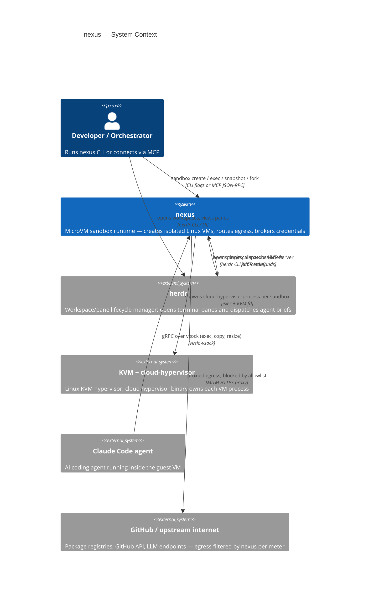
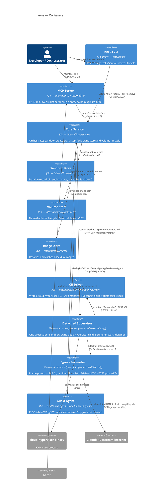

# Architecture

nexus runs workloads in microVM sandboxes — real Linux VMs with their own kernel, disk image,
and network namespace. A detached supervisor process owns each sandbox's lifetime; a gRPC agent
inside the guest (reachable over vsock) accepts exec/copy/resize commands from the host CLI or
MCP server. Credentials never enter the guest: the MITM egress proxy on the host swaps
placeholder tokens for real secrets at the perimeter.

## C4 Context diagram

## C4 Container diagram

## Container → code mapping

| Container | Primary packages |
|-----------|-----------------|
| nexus CLI | `cmd/nexus`, `internal/cli` |
| MCP Server | `internal/mcp`, `internal/cli` (shared `Service`); plugin: `plugins/claude` |
| Core Service | `internal/core/service` |
| Sandbox Store | `internal/core/store` |
| Volume Store | `internal/core/volumestore` |
| Image Store | `internal/core/image` |
| CH Driver | `internal/core/driver/cloudhypervisor` |
| Detached Supervisor | `internal/supervisor` (re-exec of `cmd/nexus` binary with `--supervisor` flag) |
| Egress Perimeter | `internal/core/perimeter`, `internal/core/perimeter/mitm`, `internal/core/perimeter/netfilter`, `internal/core/perimeter/sni` |
| Guest Agent | `cmd/nexus-agent`, `internal/core/agent/agentpb` (gRPC proto), `internal/clientagent` |

## Request flow: `nexus sandbox create`

1. **CLI** (`internal/cli/cmd_sandbox.go`) parses flags, resolves `nexus.yaml` / `.nexus/config.yaml`,
   calls `svc.Create` then `svc.Boot`.
2. **Core Service** (`internal/core/service/create.go`) mints a `domain.SandboxID`, persists the
   record via **Sandbox Store**, attaches named-volume leases via **Volume Store**, resolves the
   base disk image via **Image Store**.
3. **Service** calls `supervisor.SpawnDetached` (`internal/supervisor/spawn_linux.go`), which
   re-execs the nexus binary in a new session; the child writes a pidfile and signals readiness
   over a Unix socket.
4. **Detached Supervisor** calls the **CH Driver** (`internal/core/driver/cloudhypervisor`)
   to configure and launch the `cloud-hypervisor` process (disk, virtiofs mounts, vsock, TAP device).
5. **Supervisor** obtains the TAP fd from the driver's `NetworkHook` and passes it to
   `perimeter.Start` (`internal/core/perimeter/supervisor.go`), which launches the netfilter
   AllowList refresh goroutine and the MITM HTTPS proxy listener.
6. **Guest Agent** (`cmd/nexus-agent`) starts inside the VM, registers on vsock port 1024,
   and waits for gRPC calls.
7. **CLI** dials the agent over vsock (`internal/clientagent`), confirms readiness via `AgentInfo`,
   and returns the sandbox handle to the caller.
