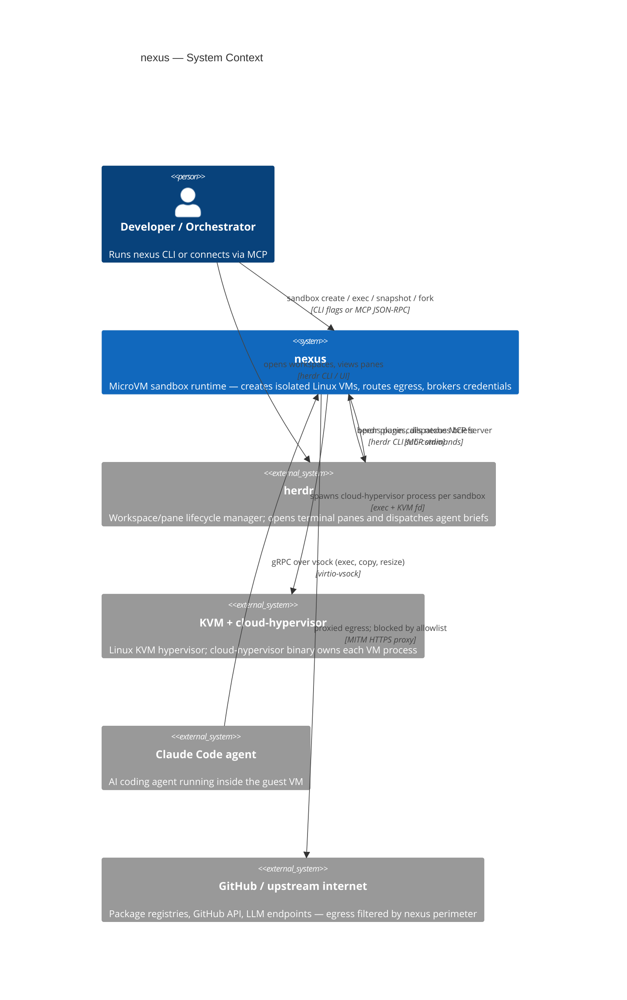
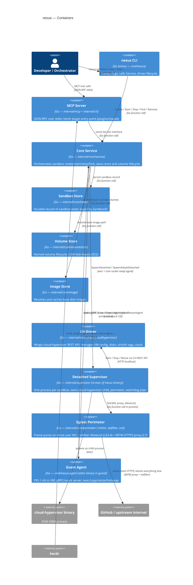

# Architecture

nexus runs workloads in microVM sandboxes — real Linux VMs with their own kernel, disk image,
and network namespace. A detached supervisor process owns each sandbox's lifetime; a gRPC agent
inside the guest (reachable over vsock) accepts exec/copy/resize commands from the host CLI or
MCP server. Credentials never enter the guest: the MITM egress proxy on the host swaps
placeholder tokens for real secrets at the perimeter.

## C4 Context diagram

```mermaid
C4Context
  title nexus — System Context

  Person(dev, "Developer / Orchestrator", "Runs nexus CLI or connects via MCP")

  System(nexus, "nexus", "MicroVM sandbox runtime — creates isolated Linux VMs, routes egress, brokers credentials")

  System_Ext(herdr, "herdr", "Workspace/pane lifecycle manager; opens terminal panes and dispatches agent briefs")
  System_Ext(kvm, "KVM + cloud-hypervisor", "Linux KVM hypervisor; cloud-hypervisor binary owns each VM process")
  System_Ext(claude, "Claude Code agent", "AI coding agent running inside the guest VM")
  System_Ext(upstream, "GitHub / upstream internet", "Package registries, GitHub API, LLM endpoints — egress filtered by nexus perimeter")

  Rel(dev, nexus, "sandbox create / exec / snapshot / fork", "CLI flags or MCP JSON-RPC")
  Rel(nexus, herdr, "opens panes, dispatches briefs", "herdr CLI sub-commands")
  Rel(nexus, kvm, "spawns cloud-hypervisor process per sandbox", "exec + KVM fd")
  Rel(claude, nexus, "gRPC over vsock (exec, copy, resize)", "virtio-vsock")
  Rel(nexus, upstream, "proxied egress; blocked by allowlist", "MITM HTTPS proxy")
  Rel(dev, herdr, "opens workspaces, views panes", "herdr CLI / UI")
  Rel(herdr, nexus, "herdr plugin calls nexus MCP server", "MCP stdio")
```

## C4 Container diagram

```mermaid
C4Container
  title nexus — Containers

  Person(dev, "Developer / Orchestrator")

  Container(cli, "nexus CLI", "Go binary — cmd/nexus", "Parses flags, calls Service, drives lifecycle")
  Container(mcp, "MCP Server", "Go — internal/mcp + internal/cli", "JSON-RPC over stdio; herdr plugin entry point (plugins/claude)")
  Container(svc, "Core Service", "Go — internal/core/service", "Orchestrates sandbox create/start/stop/fork; owns store and volume lifecycle")
  Container(store, "Sandbox Store", "Go — internal/core/store", "Durable record of sandbox state; keyed by SandboxID")
  Container(volstore, "Volume Store", "Go — internal/core/volumestore", "Named-volume lifecycle; CoW disk leases (SD2)")
  Container(imgstore, "Image Store", "Go — internal/core/image", "Resolves and caches base disk images")
  Container(driver, "CH Driver", "Go — internal/core/driver/cloudhypervisor", "Wraps cloud-hypervisor REST API; manages VM config, disks, virtiofs tags, vsock")
  Container(supervisor, "Detached Supervisor", "Go — internal/supervisor (re-exec of nexus binary)", "One process per sandbox; owns cloud-hypervisor child, perimeter, watchdog pipe")
  Container(perimeter, "Egress Perimeter", "Go — internal/core/perimeter (+mitm, netfilter, sni)", "Frame pump on vhost-user NIC; netfilter AllowList (L3/L4) + MITM HTTPS proxy (L7)")
  Container(agent, "Guest Agent", "Go — cmd/nexus-agent (static binary in guest)", "PID-1-ish in VM; gRPC/vsock server; exec/copy/resize/hotswap")

  System_Ext(kvm, "cloud-hypervisor binary", "KVM VMM process")
  System_Ext(upstream, "GitHub / upstream internet")
  System_Ext(herdr, "herdr")

  Rel(dev, cli, "nexus sandbox create / exec / …", "stdin/stdout")
  Rel(dev, mcp, "MCP tool calls", "JSON-RPC stdio")
  Rel(herdr, mcp, "herdr plugin: space-create, space-agent, …", "MCP stdio")
  Rel(cli, svc, "Create / Start / Stop / Fork / Remove", "Go function call")
  Rel(mcp, svc, "same Service interface", "Go function call")
  Rel(svc, store, "persist sandbox record", "Go function call")
  Rel(svc, volstore, "attach/detach named volumes", "Go function call")
  Rel(svc, imgstore, "resolve base image path", "Go function call")
  Rel(svc, supervisor, "SpawnDetached / SpawnAdoptDetached", "exec + Unix socket ready-signal")
  Rel(supervisor, driver, "Start / Stop / Resize via CH REST API", "HTTP localhost")
  Rel(supervisor, kvm, "spawns as child process", "exec")
  Rel(supervisor, perimeter, "Start(fd, proxy, allowList)", "Go function call in-process")
  Rel(perimeter, upstream, "allow-listed HTTPS; blocks everything else", "MITM proxy + netfilter")
  Rel(agent, svc, "vsock gRPC: Exec / Copy / AgentInfo / RestartAgent", "virtio-vsock CID")
  Rel(svc, agent, "dials vsock to run commands in guest", "virtio-vsock")
```

## Container → code mapping

| Container | Primary packages |
|-----------|-----------------|
| nexus CLI | `cmd/nexus`, `internal/cli` |
| MCP Server | `internal/mcp`, `internal/cli` (shared `Service`); plugin: `plugins/claude` |
| Core Service | `internal/core/service` |
| Sandbox Store | `internal/core/store` |
| Volume Store | `internal/core/volumestore` |
| Image Store | `internal/core/image` |
| CH Driver | `internal/core/driver/cloudhypervisor` |
| Detached Supervisor | `internal/supervisor` (re-exec of `cmd/nexus` binary with `--supervisor` flag) |
| Egress Perimeter | `internal/core/perimeter`, `internal/core/perimeter/mitm`, `internal/core/perimeter/netfilter`, `internal/core/perimeter/sni` |
| Guest Agent | `cmd/nexus-agent`, `internal/core/agent/agentpb` (gRPC proto), `internal/clientagent` |

## Request flow: `nexus sandbox create`

1. **CLI** (`internal/cli/cmd_sandbox.go`) parses flags, resolves `nexus.yaml` / `.nexus/config.yaml`,
   calls `svc.Create` then `svc.Boot`.
2. **Core Service** (`internal/core/service/create.go`) mints a `domain.SandboxID`, persists the
   record via **Sandbox Store**, attaches named-volume leases via **Volume Store**, resolves the
   base disk image via **Image Store**.
3. **Service** calls `supervisor.SpawnDetached` (`internal/supervisor/spawn_linux.go`), which
   re-execs the nexus binary in a new session; the child writes a pidfile and signals readiness
   over a Unix socket.
4. **Detached Supervisor** calls the **CH Driver** (`internal/core/driver/cloudhypervisor`)
   to configure and launch the `cloud-hypervisor` process (disk, virtiofs mounts, vsock, vhost-user NIC).
5. **Supervisor** obtains the guest frame fd from the driver's `NetworkHook` and passes it to
   `perimeter.Start` (`internal/core/perimeter/supervisor.go`), which launches the netfilter
   AllowList refresh goroutine and the MITM HTTPS proxy listener.
6. **Guest Agent** (`cmd/nexus-agent`) starts inside the VM, registers on vsock port 1024,
   and waits for gRPC calls.
7. **CLI** dials the agent over vsock (`internal/clientagent`), confirms readiness via `AgentInfo`,
   and returns the sandbox handle to the caller.

## Lifecycle design notes

### Store-only records and bootability

A store-only record has neither a root disk nor an initramfs. Two guards refuse to boot it; both
map to `sandboxErrCodeNotBootable`:

1. **Service guard** (`internal/core/service/service.go`, Start): when `diskDir` is set (always
   true in tests via `WithDiskDir`), the service checks for the backing disk before calling the
   driver.
2. **Driver guard** (`internal/core/driver/cloudhypervisor/driver.go`): when `diskDir` is empty,
   the CH driver returns `ErrNoRootDisk` before the netns child spawns, so the caller gets an
   immediate error instead of a ten-second boot timeout.

Tests that Start a sandbox (e.g. `fork_preflight_test.go`) seed a root disk first for this reason.

### Port forwarding host ports

- The supervisor binds an ephemeral host port per bound guest port (`hostPorts` in
  `internal/supervisor/portfwd.go`).
- `HostPort` (`internal/core/portfwd/discovery.go`) is the host-side port on the engine. The
  supervisor sets it after binding; the remote client uses it as the `ssh -W` target.
- `RemotePort` (`internal/core/portfwd/local_forward.go`) is the engine host port to proxy to.
  Zero falls back to `Port`, preserving the pre-HostPort behaviour.

### Stale OCI bake detection

`internal/core/service/create.go` re-pulls a cached base image when the guest agent changed since
the bake, or when the cache entry predates agent-tag tracking. Tag mechanics are
documented in the comments above the stale-cache check in `create.go`
(`builderimage.CacheTag`).

### User mount prefixes

`usermount_test.go` fixtures cover a path that duplicates another after `filepath.Clean`, and a
single-file mount, which never contributes a directory prefix.

## Builder and storage design notes

### Cross-device staging (`internal/core/builder/worktreedisk.go`)

When the staging directory is on a different device from the source, `os.Link` is impossible and
every captured file is copied. That is refused only when the staging device is memory-backed
(tmpfs/ramfs, e.g. a tmpfs `/tmp`) — the host-OOM case the package exists to prevent. A
disk-backed staging dir only costs disk, and is the only option when the source cannot host a
sibling: inside a nexus guest `/workspace` is a virtiofs share of the host checkout, so staging
"next to the source" would mean writing into the operator's worktree over the wire (2026-09-19:
nested `sandbox create --file` was refused with `/tmp` on its own ext4 disk).

### Builder admission inside a nexus guest

A nexus guest is detected from `--mem-ceiling` on the kernel cmdline the outer nexus writes
(`InNexusGuest`); absent or malformed means plain host semantics. Only a nexus guest skips builder
admission. Host semantics are unchanged: the recorded live refusal (4036 MiB total, 1160 MiB
available) still refuses a 2048 MiB builder. `vmcfg` gives a nested guest a lower default memory
ceiling than the 4096 MiB floor so it can admit its own 3072 MiB builder VM with the agent still
resident; explicit ceilings win. `vmcfg_test.go` pins this: dropping the `c.Nested` branch yields
4096 and fails the test.

### OCI base image agent tag

Cached OCI bakes record the guest agent's tag (`AgentTag`). `PullAndCacheOCI` re-pulls when the
tag differs from the current agent, and also when it is empty (entry written before tag tracking):
an empty tag is a miss, not a hit. A matching tag is served without a pull.

### Volume reclaim (`internal/core/volumestore/store.go`)

- Reclaim runs only when this Detach caused full detachment, not on a no-op Detach.
- `rec.SizeBytes` is not changed by reclaim: declared capacity must survive it.
- Reclaim gets its own generous timeout, decoupled from the caller's short detach context, but
  runs in-process rather than in the background, so this process holds the flock for the whole
  reclaim. Otherwise a short-lived CLI caller returning early would leave e2fsck/resize2fs running
  unlocked.

### Self-host Containerfile (`.nexus/Containerfile`)

- `busybox-static` and `cpio`: `scripts/fetch-boot-artifacts.sh` builds the alpine initramfs with
  cpio (`TestLiveVirtiofsE2E` skips without it), and a hand-rolled probe rootfs needs busybox.
- `nodejs`: the operator's Claude Code hooks and the groundwork commit-msg hook shell out to
  `node`. The claude binary stopped bundling node at the OCI recipe cutover, so without it every
  prompt and commit in the guest logs a hook failure.
