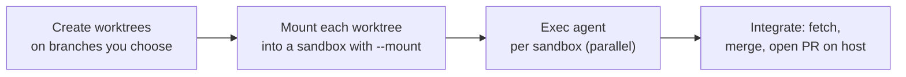

# Parallel development flow

> Create git worktrees on the branches you choose, mount them into isolated sandboxes, run agents
> concurrently, and integrate through ordinary git — nexus provides the isolation primitives only.

Each sandbox is fully isolated: separate disk, separate network namespace, separate vsock channel.
Each mounts its own `git worktree` directory so commits inside the sandbox land directly on the
host's worktree branch, with no nexus branch naming or identity seeding involved.

---

## Overview



---

## Step 1 — Create worktrees on the host

nexus is git-unaware. You decide the branch names and worktree locations.

```sh
git worktree add ../myrepo-task-42 -b feat/task-42
git worktree add ../myrepo-task-43 -b feat/task-43
```

The worktree directory is a full working copy of the repo on the named branch. The repo-local
`git config` in the worktree is inherited automatically by any process running inside it — no
additional identity seeding is needed.

---

## Step 2 — Mount each worktree into a sandbox <Badge type="warning" text="partial" />

```sh
nexus create myproject/task-42 \
  --image nexus-base:20260807 \
  --mount /path/to/myrepo-task-42:/workspace/myrepo \
  --memory 4096 \
  --label task-id=42
```

<Badge type="warning" text="partial" /> — current implementation uses `nexus sandbox create`; see [CLI sandbox commands](/cli/sandbox-commands) for the mapping.

For N sandboxes, loop over `nexus create`:

```sh
for task in 42 43 44; do
  git worktree add ../myrepo-task-$task -b feat/task-$task

  nexus create myproject/task-$task \
    --image nexus-base:20260807 \
    --mount /path/to/myrepo-task-$task:/workspace/myrepo \
    --memory 4096 \
    --label task-id=$task
done
```

---

## Step 3 — Exec the agent

```sh
nexus exec myproject/task-42 -- /usr/local/bin/claude --task "fix the flaky test"
```

Fan out across all labelled sandboxes in parallel:

```sh
for sb in $(nexus --json ps --label task-id | jq -r '.data.sandboxes[].handle'); do
  nexus exec "$sb" -- /usr/local/bin/claude --task "fix the flaky test" &
  # bound concurrency to available host memory
  while [ "$(jobs -r | wc -l)" -ge 2 ]; do wait -n; done
done
wait
```

---

## Step 4 — In-guest commits land on the worktree branch

Because the worktree is live-mounted, any `git commit` the agent makes inside the sandbox appears
immediately in the host directory `/path/to/myrepo-task-42`. The commit is on `feat/task-42` — the
branch the worktree was created on. nexus does not rename branches or inject a bot identity; the
repo-local `git config` inside the worktree applies as-is.

---

## Step 5 — Push results

**Option A — push on the host (credentials stay host-only)**

```sh
git -C /path/to/myrepo-task-42 push origin feat/task-42
git -C /path/to/myrepo-task-43 push origin feat/task-43
```

**Option B — push in-guest via the MITM credential path** <Badge type="danger" text="not built — in-guest git push via MITM credential path is not yet wired; use Option A" />

Pass `--repo` at create time to bind the sandbox to a specific repository allowlist entry. The
MITM proxy swaps the placeholder credential for a real one on GitHub requests that match the
allowlist:

```sh
nexus create myproject/task-42 \
  --image nexus-base:20260807 \
  --mount /path/to/myrepo-task-42:/workspace/myrepo \
  --memory 4096 \
  --repo owner/myrepo \
  --label task-id=42
```

The agent can then run `git push` from inside the sandbox without any additional credential
configuration. See [Egress and perimeter](/security/egress-and-perimeter) for the allowlist and
placeholder-swap mechanism.

---

## Step 6 — Integrate on the host

```sh
# Inspect each branch
git -C /path/to/myrepo fetch origin
git log origin/feat/task-42 --oneline -5

# Open a pull request per branch (host side)
gh pr create --head feat/task-42 --title "Fix flaky test (task 42)"
```

`gh pr create` only works here on the host. Inside a sandbox it is refused (it
uses GitHub's GraphQL API, which the perimeter denies); an agent opening its own
PR from inside the sandbox must use the REST form instead:

```sh
gh api -X POST repos/<owner>/<repo>/pulls -f title="Fix flaky test (task 42)" -f head=feat/task-42 -f base=main
```

---

## Disk capacity planning

Before a multi-sandbox session, check free space:

```sh
df -h ~/.local/state/nexus/
```

Rules of thumb (measured on a real compose monorepo):

| Metric | Value |
|---|---|
| Fresh idle sandbox — apparent size | ~4 GiB |
| Fresh idle sandbox — allocated (sparse actual) | ~120 MiB |
| Warm sandbox after build — allocated | ~4.57 GiB |
| Practical concurrent-builds ceiling (swap) | 2 |

Reclaim stale sandboxes before a multi-sandbox run:

```sh
nexus ps
nexus rm <stale-ref>
```

---

## Lifecycle notes

- A `paused` sandbox must be resumed before it can be stopped or removed. The transition
  `paused → stopped` is illegal and returns an error.
- `nexus run` is the ephemeral variant: creates, boots, executes, and removes in one command. Use
  it for throwaway one-shot tasks; for the parallel flow you need the sandbox to persist across
  multiple `exec` calls, so use `nexus create` instead.
- Remove worktrees after the sandboxes that mount them are removed:
  `git worktree remove /path/to/myrepo-task-42`.

---

## See also

- [Mounts and worktrees](mounts-and-worktrees.md)
- [Egress and perimeter](/security/egress-and-perimeter)
- [Surface reference — `exec`](/cli/#commands)
