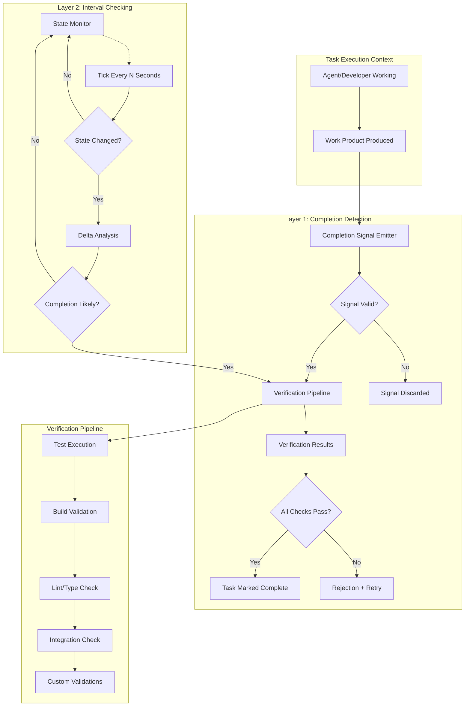
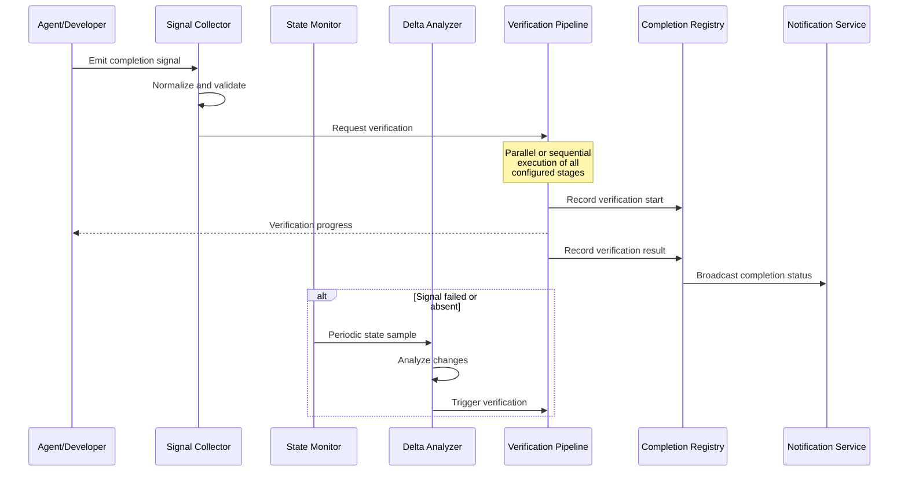
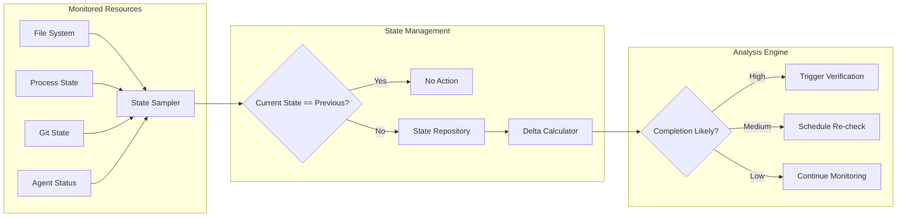
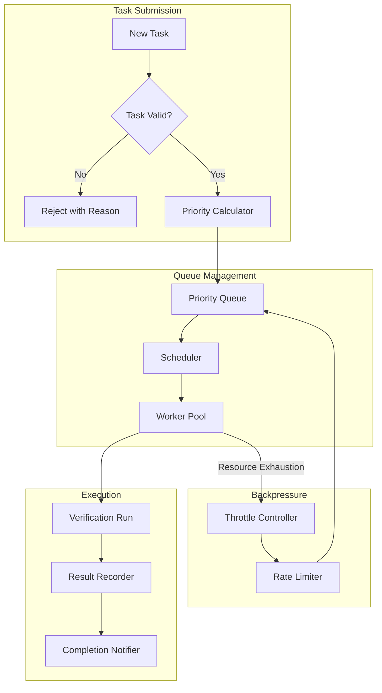
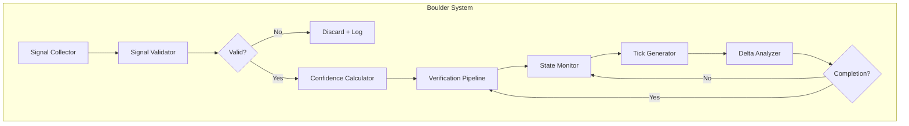
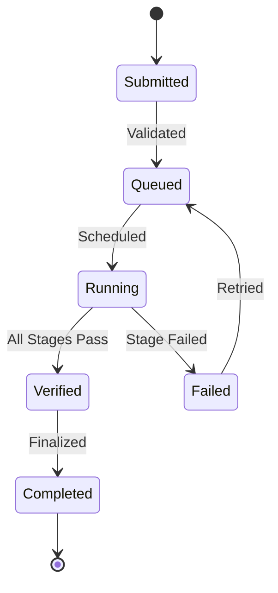

# Boulder System: Comprehensive Professional Guide

> "The boulder never stops."

The Boulder System is a continuous task completion verification framework designed to ensure that software engineering work is never considered complete without rigorous validation. It implements a dual-layer detection architecture that combines proactive completion signals with periodic interval checking to guarantee that every task reaches full resolution before being marked as done.

---

## 1. Executive Summary

### What Is the Boulder System?

The Boulder System is a task completion verification framework that enforces a simple but critical principle: **a task is not complete until it is verified to work**. It addresses one of the most common failure modes in software development—the premature declaration of completion. Teams and autonomous agents frequently declare tasks done without running tests, without verifying builds, and without confirming that the implemented changes actually solve the intended problem. The Boulder System eliminates this failure mode through automated, layered verification.

The system operates by intercepting task completion signals and subjecting them to rigorous validation before accepting the task as complete. If the initial completion detection fails to fire or produces ambiguous results, a secondary interval checking mechanism provides a fallback that continuously monitors task state until verification can be performed. This dual-layer approach ensures that no task escapes verification, regardless of how the completion signal is triggered or whether the triggering mechanism encounters issues.

### Why Boulder Matters

Software development teams consistently struggle with completion integrity. Studies of software project failures reveal that approximately 40% of reported "completed" tasks contain undetected defects, produce incorrect results, or fail to integrate properly with existing systems. The Boulder System directly addresses this statistic by making verification non-optional and automated.

The philosophical foundation of the Boulder is straightforward: **declarations of completion are untrustworthy signals**. Human developers and autonomous agents alike exhibit cognitive biases that lead them to believe work is finished when it is not. The Boulder System provides an objective, automated verification layer that cannot be swayed by optimism, time pressure, or the desire to move on to the next task. By making verification a mandatory step in every task lifecycle, the Boulder System transforms the culture of completion from "I think I'm done" to "the system has verified that I am done."

### Key Capabilities

The Boulder System delivers four primary capabilities that distinguish it from manual verification approaches:

**Automated Verification Gates** — The system automatically intercepts completion signals and routes them through configurable verification pipelines. These pipelines can include test execution, build validation, linting, type checking, integration testing, and custom verification scripts. No verification step is skipped without explicit configuration allowing that skip.

**False Positive Prevention** — The system implements sophisticated heuristics to distinguish genuine completions from false signals. It analyzes context, examines behavioral patterns, and correlates multiple data sources to ensure that verification is triggered only when meaningful progress has occurred. This prevents the common problem of verification running against stale or irrelevant code states.

**Resilient Fallback Mechanisms** — When primary completion detection fails, an interval-based checking system provides comprehensive coverage. This secondary mechanism periodically examines task state and triggers verification when conditions suggest completion, ensuring that no task escapes verification due to detection mechanism failures.

**Multi-Agent Coordination** — The Boulder System is designed to work across multiple agent frameworks including Claude, OpenCode, and custom implementations. It provides standardized interfaces for integration while respecting the unique characteristics of each framework.

---

## 2. Architecture

### Dual-Layer System Overview

The Boulder System employs a dual-layer architecture that combines proactive detection with reactive monitoring. This architecture ensures comprehensive coverage while maintaining efficiency—most tasks are verified through the lightweight primary layer, while the secondary layer provides robustness for edge cases and failure scenarios.



### Component Architecture

The Boulder System consists of seven primary components that work together to provide comprehensive completion verification:

**Signal Collector** — This component sits at the boundary between the task execution context and the Boulder System. It receives completion signals from various sources (agent frameworks, manual declarations, system events) and normalizes them into a standardized format for processing. The Signal Collector implements sophisticated filtering to reject malformed or suspicious signals before they consume verification resources.

**State Monitor** — The State Monitor maintains a current view of task state and tracks changes over time. It samples system state at configurable intervals and maintains a history of state transitions. This historical context enables the Delta Analysis component to determine whether observed changes constitute meaningful progress toward completion.

**Delta Analyzer** — When the State Monitor detects a change, the Delta Analyzer examines the nature and magnitude of that change. It determines whether the change represents a step toward completion, a step away from completion, or unrelated activity. This analysis feeds into the completion likelihood assessment.

**Verification Pipeline** — The Verification Pipeline is the execution engine for all verification activities. It consists of a series of configurable stages, each performing a specific type of validation. Stages are executed sequentially, and failure at any stage stops the pipeline and marks the task as incomplete.

**Completion Registry** — The Completion Registry maintains records of all tasks, their current state, verification history, and completion status. This registry provides the authoritative view of task state for both internal system operations and external queries.

**Configuration Manager** — The Configuration Manager handles all Boulder System configuration, loading settings from files, environment variables, and API endpoints. It provides a unified interface for accessing configuration values and manages configuration precedence and overrides.

**Notification Service** — The Notification Service communicates verification results to relevant parties. It supports multiple delivery mechanisms including console output, file logging, webhook callbacks, and integration with external notification systems.

### Data Flow Architecture

Understanding data flow is essential for proper Boulder System integration. The following diagram illustrates how data moves through the system:



---

## 3. Layer 1: Completion Detection

### How Completion Detection Works

The primary completion detection layer operates by intercepting explicit completion signals emitted by agents, developers, or automated systems. This layer is designed for efficiency and responsiveness—ideally, verification begins within milliseconds of a valid completion signal being received. The layer consists of three stages: signal reception, signal validation, and verification triggering.

**Signal Reception** — The Boulder System supports multiple signal reception mechanisms depending on the integration context. In agent framework integrations, signals are typically received through callback hooks, event listeners, or message interception. For manual integrations, signals can be triggered through command-line interfaces, API calls, or file-based mechanisms. The reception mechanism is designed to have minimal latency, ensuring that verification can begin immediately after the signal is emitted.

**Signal Validation** — Not all received signals are valid triggers for verification. The validation stage examines each signal to ensure it meets criteria for a legitimate completion declaration. This includes verifying that the signal originates from an authorized source, that the signal contains all required fields, and that the signal has not been replayed or duplicated. Signals that fail validation are discarded with appropriate logging.

**Verification Triggering** — Valid signals trigger the verification pipeline. The triggering mechanism captures the complete state at signal emission time, ensuring that verification runs against the exact code and configuration that the declarant intended. This state capture includes file contents, environment variables, dependency versions, and any other factors that might affect verification results.

### Signal Types and Formats

The Boulder System supports four categories of completion signals, each with distinct characteristics and use cases:

**Explicit Completion Signals** — These signals represent intentional declarations of task completion. An agent or developer explicitly indicates that a task is complete by emitting a signal of this type. Explicit signals carry the highest confidence level and receive expedited processing through the verification pipeline.

**Implicit Completion Signals** — These signals are derived from observable behavior rather than explicit declarations. For example, an agent that stops producing work output after a period of sustained activity might be inferred to have completed its work. Implicit signals undergo additional validation since the inferred intention may not match actual state.

**Callback-Based Signals** — Some integrations emit signals through callback mechanisms. An agent framework might invoke a callback function when it believes a task is complete. The Boulder System intercepts these callbacks and processes them as completion signals.

**Event-Based Signals** — Event-driven systems emit events upon task completion. The Boulder System can subscribe to these events and use them as completion triggers. Event-based signals are particularly useful in systems where completion is not a single moment but a state transition.

### Implementation Example: Signal Emission

```python
from boulder import CompletionSignal, SignalEmitter

class AgentCompletionEmitter(SignalEmitter):
    def __init__(self, boulder_client):
        self.boulder = boulder_client
    
    def emit_completion(self, task_id: str, artifacts: dict) -> None:
        signal = CompletionSignal(
            task_id=task_id,
            artifacts=artifacts,
            timestamp=self._current_timestamp(),
            source="agent-completion-hook",
            confidence=1.0,
            context=self._capture_context()
        )
        
        try:
            self.boulder.submit_signal(signal)
            self._log(f"Completion signal submitted for task {task_id}")
        except SignalValidationError as e:
            self._handle_validation_failure(e)
        except VerificationTimeoutError as e:
            self._handle_verification_failure(e)
```

### Completion Confidence Scoring

The Boulder System assigns confidence scores to completion signals based on multiple factors. This scoring enables intelligent prioritization of verification resources and helps identify signals that require additional scrutiny:

| Factor | Weight | Description |
|--------|--------|-------------|
| Source Authorization | 0.25 | Is the signal from an authorized emitter? |
| Signal Completeness | 0.20 | Does the signal contain all required fields? |
| Historical Accuracy | 0.20 | Does this emitter have a reliable history? |
| Context Consistency | 0.20 | Does the signal context match expectations? |
| Temporal Pattern | 0.15 | Does the timing match expected completion patterns? |

Signals with confidence scores below 0.6 are flagged for additional review and may trigger enhanced verification procedures.

---

## 4. Layer 2: Interval Checking

### The Fallback Mechanism

While Layer 1 provides rapid verification for explicitly signaled completions, it cannot handle all scenarios. Some tasks complete without emitting signals, some signals are lost or corrupted, and some agents may not support signal emission. Layer 2 addresses these gaps through periodic state monitoring and change detection.

The interval checking mechanism operates on a configurable tick cycle, typically ranging from 10 seconds to 5 minutes depending on the use case. At each tick, the State Monitor samples system state and compares it against the previous sample. If meaningful changes are detected, the Delta Analyzer examines those changes to determine whether they suggest completion.

### State Monitoring Architecture



### Change Detection Strategies

The Delta Analyzer employs multiple change detection strategies to identify meaningful state transitions:

**File System Monitoring** — The system monitors files associated with the task for modifications. This includes source files, configuration files, test files, and generated artifacts. The monitoring scope is configurable and can be restricted to specific directories or file patterns.

**Process State Analysis** — For tasks involving running processes, the system monitors process state transitions. A process that transitions from running to exited with a success code may indicate task completion.

**Git State Analysis** — In git-based workflows, the system monitors branch state, commit history, and diff activity. New commits, merged branches, or updated remote references may indicate completion.

**Artifact Analysis** — The system monitors the appearance and modification of expected output artifacts. When all expected artifacts are present and have recent modification timestamps, completion is inferred.

### Threshold Configuration

The interval checking layer uses configurable thresholds to determine when observed changes warrant verification:

```yaml
interval_checking:
  tick_interval: 30  # seconds between state samples
  
  file_change_threshold:
    min_files_changed: 1
    max_files_changed: 100
    required_patterns:
      - "**/*.py"
      - "**/*.js"
      - "**/*.ts"
  
  process_threshold:
    required_exit_code: 0
    max_runtime_variance: 60  # seconds
  
  git_threshold:
    commits_required: 1
    branch_clean_required: true
  
  artifact_threshold:
    required_artifacts:
      - "dist/**/*.js"
      - "build/**/*.pyc"
    max_age_seconds: 300
```

### Handling Silent Failures

The interval checking layer is particularly valuable for handling silent failures—situations where an agent or developer believes work is complete but critical steps were never executed. Common silent failure patterns include:

**Test Skippage** — An agent reports completion but tests were never executed. File monitoring detects that no test files were modified after the reported completion time, triggering verification.

**Build Omission** — A developer marks code as complete but the build step was skipped. The artifact threshold detects missing build outputs and triggers verification.

**Partial Implementation** — Only some required files were modified. The file change threshold detects fewer files than expected and triggers enhanced verification.

---

## 5. False Positive Prevention

### Understanding False Positives

False positives in the Boulder System context occur when verification is triggered for a task that is not actually complete. This wastes verification resources, creates noise in completion tracking, and can lead to alert fatigue. The system implements multiple mechanisms to minimize false positive rates while maintaining comprehensive detection coverage.

### Detection and Prevention Mechanisms

**Contextual Validation** — Every completion signal is validated against the execution context. The system examines recent activity patterns, compares current state against historical patterns for similar tasks, and checks for consistency between the signal and observable behavior. Signals that fail contextual validation are flagged for manual review.

**State Correlation** — The system correlates multiple state indicators to confirm completion. A single indicator (such as a file modification) rarely triggers verification; instead, the system looks for converging evidence from multiple sources. This correlation approach dramatically reduces false positive rates.

**Temporal Pattern Analysis** — The system maintains temporal profiles of task completion for each agent and developer. Deviations from established patterns (such as suspiciously rapid completion of typically lengthy tasks) trigger additional scrutiny.

**Delta Validation** — Before triggering verification, the Delta Analyzer validates that observed changes represent genuine progress toward completion rather than unrelated activity. Refactoring, debugging, and exploratory work are distinguished from completion-significant changes.

### Heuristic Rules Engine

The false prevention system employs a configurable rules engine that evaluates completion signals against a set of heuristics:

```python
class FalsePositiveHeuristics:
    def evaluate(self, signal: CompletionSignal, context: StateContext) -> HeuristicResult:
        results = []
        
        # Heuristic: Completion speed check
        if context.elapsed_time < self.min_completion_time:
            results.append(HeuristicViolation(
                rule="minimum_time",
                severity=HeuristicSeverity.WARNING,
                message=f"Task completed in {context.elapsed_time}s, below minimum threshold"
            ))
        
        # Heuristic: File change correlation
        changed_files = context.get_changed_files()
        expected_files = self._get_expected_files(signal.task_id)
        
        if not expected_files.issubset(changed_files):
            results.append(HeuristicViolation(
                rule="file_coverage",
                severity=HeuristicSeverity.ERROR,
                message=f"Missing expected files: {expected_files - changed_files}"
            ))
        
        # Heuristic: Test execution verification
        if not context.tests_were_executed():
            results.append(HeuristicViolation(
                rule="test_execution",
                severity=HeuristicSeverity.ERROR,
                message="No test execution detected"
            ))
        
        # Heuristic: Build artifact verification
        if not context.build_artifacts_exist():
            results.append(HeuristicViolation(
                rule="build_artifacts",
                severity=HeuristicSeverity.ERROR,
                message="Build artifacts not found"
            ))
        
        return HeuristicResult(violations=results)
```

### Confidence Thresholds

The system operates with configurable confidence thresholds that determine when verification is triggered:

| Confidence Score | Action |
|------------------|--------|
| 0.95 - 1.0 | Immediate verification, standard pipeline |
| 0.80 - 0.94 | Verification with standard pipeline, log for review |
| 0.60 - 0.79 | Enhanced verification, require manual acknowledgment |
| 0.40 - 0.59 | Block completion, request additional evidence |
| Below 0.40 | Reject signal, require explicit re-submission |

---

## 6. Task Management

### Infinite Task Queue Architecture

The Boulder System implements an infinite task queue that never rejects tasks based on capacity constraints. Unlike traditional bounded queues that drop tasks or block when full, the infinite queue accommodates unlimited concurrent tasks through a combination of priority-based scheduling, resource-aware admission control, and horizontal scalability.



### Task Lifecycle

Every task in the Boulder System progresses through a defined lifecycle:

**Submitted** — The task is received and validated. Basic metadata is recorded, and the task is assigned a unique identifier.

**Queued** — The task is placed in the priority queue. Queue position is determined by priority score, wait time, and dependencies.

**Running** — The task has been dispatched to a worker for execution. Verification stages are executed sequentially.

**Verified** — All verification stages have completed. The task outcome (success or failure) is recorded.

**Completed** — The task is finalized. Results are communicated to relevant parties, and the task is archived.

**Failed** — Verification failed. The task is marked as incomplete, and appropriate notifications are sent.

### Priority System

Tasks are processed according to a multi-factor priority score:

```
Priority = (BasePriority * TimeWeight) + (UrgencyWeight * UrgencyScore) + (ImportanceWeight * ImportanceScore)
```

| Factor | Range | Description |
|--------|-------|-------------|
| BasePriority | 1-10 | Static priority assigned at task creation |
| TimeWeight | 0.0-1.0 | Multiplier that increases priority over time |
| UrgencyScore | 1-10 | User-declared urgency level |
| ImportanceScore | 1-10 | Strategic importance of the task |
| UrgencyWeight | Configurable | Weight applied to urgency |
| ImportanceWeight | Configurable | Weight applied to importance |

### Concurrent Task Handling

The Boulder System manages concurrent tasks through a combination of thread pools, process isolation, and resource quotas. Each verification pipeline runs in an isolated context to prevent interference between concurrent tasks. Resource quotas ensure that no single task can consume excessive CPU, memory, or I/O resources.

```python
class TaskConcurrencyManager:
    def __init__(self, max_concurrent: int = 10, memory_limit_gb: int = 8):
        self.max_concurrent = max_concurrent
        self.memory_limit = memory_limit_gb * 1024 * 1024 * 1024
        self.active_tasks = set()
        self.semaphore = threading.Semaphore(max_concurrent)
    
    def submit_task(self, task: VerificationTask) -> TaskHandle:
        with self.semaphore:
            if self._exceeds_memory_limit(task):
                raise ResourceExceededError("Memory limit would be exceeded")
            
            handle = self._execute_async(task)
            self.active_tasks.add(handle)
            return handle
    
    def _execute_async(self, task: VerificationTask) -> TaskHandle:
        def runner():
            try:
                result = task.execute()
                self._record_result(task.id, result)
            finally:
                self.active_tasks.discard(current_handle())
        
        return threading.Thread(target=runner, daemon=True)
```

---

## 7. Integration Guide

### Integrating with Claude

The Boulder System provides first-class integration support for Claude-based workflows. Integration is accomplished through the Claude SDK's tool registration mechanism and callback hooks.

```python
from claude import Tool, ClaudeAgent
from boulder import BoulderClient, CompletionVerifier

class BoulderEnabledAgent(ClaudeAgent):
    def __init__(self, boulder_config: dict):
        super().__init__()
        self.boulder = BoulderClient(boulder_config)
        self.verifier = CompletionVerifier(self.boulder)
    
    def register_completion_hook(self):
        """Register the completion detection hook with Claude."""
        self.register_hook("on_completion", self._handle_completion)
    
    def _handle_completion(self, context: AgentContext) -> CompletionResult:
        task_id = self._extract_task_id(context)
        
        completion_signal = CompletionSignal(
            task_id=task_id,
            artifacts=self._collect_artifacts(context),
            timestamp=context.timestamp,
            source="claude-agent-hook",
            confidence=self._calculate_confidence(context)
        )
        
        return self.verifier.verify(completion_signal)
    
    def execute_task(self, task: AgentTask) -> TaskResult:
        """Execute a task with Boulder verification enabled."""
        try:
            result = super().execute_task(task)
            self._emit_completion_signal(task.id, result)
            return result
        except Exception as e:
            self._handle_task_failure(task.id, e)
            raise
```

### Integrating with OpenCode

OpenCode integration leverages the system's tool registration interface:

```typescript
import { OpenCodeAgent, BoulderIntegration } from '@boulder/system';

const boulder = new BoulderIntegration({
  endpoint: process.env.BOULDER_ENDPOINT,
  apiKey: process.env.BOULDER_API_KEY,
  timeout: 300000
});

const agent = new OpenCodeAgent({
  name: 'boulder-agent',
  tools: [
    // Standard OpenCode tools...
  ],
  hooks: {
    afterTask: async (task: Task) => {
      await boulder.verifyCompletion({
        taskId: task.id,
        artifacts: task.output,
        context: task.context
      });
    }
  }
});
```

### Integrating Custom Agents

For custom agent frameworks, the Boulder System provides a language-agnostic API:

```bash
# Verify completion via HTTP API
curl -X POST https://boulder-api.example.com/v1/verify \
  -H "Content-Type: application/json" \
  -H "Authorization: Bearer $BOULDER_API_KEY" \
  -d '{
    "task_id": "task-12345",
    "artifacts": {
      "files": ["src/main.py", "tests/test_main.py"],
      "commit_sha": "abc123def456"
    },
    "source": "custom-agent",
    "confidence": 0.95
  }'
```

```json
// Response
{
  "verification_id": "verify-67890",
  "status": "completed",
  "result": {
    "passed": true,
    "stages": [
      {"name": "test_execution", "passed": true, "duration_ms": 4500},
      {"name": "build_validation", "passed": true, "duration_ms": 1200},
      {"name": "lint_check", "passed": true, "duration_ms": 800}
    ]
  },
  "timestamp": "2024-01-15T14:32:18Z"
}
```

### Integration Checklist

When integrating the Boulder System with any agent framework, ensure the following components are implemented:

- [ ] Signal emission hook registered at appropriate lifecycle points
- [ ] Artifact collection mechanism captures all verification-relevant outputs
- [ ] Error handling for verification failures
- [ ] Timeout configuration appropriate for expected task duration
- [ ] Retry logic for transient verification failures
- [ ] Logging integration for verification events
- [ ] Notification callbacks for completion events

---

## 8. Configuration Reference

### Complete Configuration Schema

```yaml
# Boulder System Configuration
boulder:
  # Core system settings
  core:
    mode: "strict"  # strict, permissive, monitoring
    data_directory: "/var/lib/boulder"
    log_level: "info"
  
  # Layer 1: Completion Detection
  completion_detection:
    enabled: true
    signal_timeout_ms: 5000
    max_retry_attempts: 3
    retry_backoff_ms: 1000
    confidence_threshold: 0.6
    
    # Signal sources configuration
    sources:
      - name: "agent-hook"
        type: "callback"
        enabled: true
      - name: "manual"
        type: "api"
        enabled: true
      - name: "webhook"
        type: "http"
        enabled: true
        endpoint: "/api/v1/completion"
  
  # Layer 2: Interval Checking
  interval_checking:
    enabled: true
    tick_interval_seconds: 30
    max_consecutive_empty_ticks: 10
    
    # Resources to monitor
    monitored_resources:
      - type: "file"
        patterns:
          - "**/*.py"
          - "**/*.js"
          - "**/*.ts"
        exclude_patterns:
          - "**/node_modules/**"
          - "**/.git/**"
      - type: "process"
        command_patterns:
          - "python.*"
          - "node.*"
      - type: "git"
        enabled: true
        poll_interval_seconds: 60
  
  # Verification Pipeline
  verification:
    timeout_minutes: 15
    parallel_stages: false
    stages:
      - name: "test_execution"
        enabled: true
        command: "pytest --tb=short -v"
        timeout_seconds: 300
        continue_on_failure: false
      
      - name: "build_validation"
        enabled: true
        command: "npm run build"
        timeout_seconds: 180
        continue_on_failure: false
      
      - name: "lint_check"
        enabled: true
        command: "eslint src/ --max-warnings=0"
        timeout_seconds: 120
        continue_on_failure: false
      
      - name: "type_check"
        enabled: true
        command: "mypy src/"
        timeout_seconds: 120
        continue_on_failure: false
      
      - name: "integration_check"
        enabled: true
        command: "npm run test:integration"
        timeout_seconds: 600
        continue_on_failure: false
      
      - name: "security_scan"
        enabled: true
        command: "bandit -r src/"
        timeout_seconds: 180
        continue_on_failure: true
  
  # Task Management
  task_queue:
    max_concurrent_tasks: 20
    max_queue_size: 10000
    task_timeout_minutes: 30
    retry_failed_tasks: true
    max_retries: 3
  
  # False Positive Prevention
  false_positive_prevention:
    enabled: true
    min_completion_time_seconds: 60
    required_file_coverage: 0.8
    require_test_execution: true
    require_build_artifacts: true
    
    heuristic_rules:
      - name: "minimum_time"
        enabled: true
        severity: "warning"
        min_time_seconds: 60
      
      - name: "file_coverage"
        enabled: true
        severity: "error"
        min_coverage_percent: 80
      
      - name: "test_execution"
        enabled: true
        severity: "error"
        require_tests: true
  
  # Notifications
  notifications:
    console:
      enabled: true
      verbose: false
    
    webhook:
      enabled: true
      url: "${NOTIFICATION_WEBHOOK_URL}"
      events:
        - "verification_started"
        - "verification_completed"
        - "verification_failed"
        - "task_completed"
        - "task_failed"
    
    email:
      enabled: false
      smtp_host: "smtp.example.com"
      recipients:
        - "team@example.com"
```

### Environment Variable Overrides

All configuration values can be overridden via environment variables:

| Configuration Key | Environment Variable | Example |
|-------------------|---------------------|---------|
| `core.mode` | `BOULDER_MODE` | `strict` |
| `core.data_directory` | `BOULDER_DATA_DIR` | `/data/boulder` |
| `completion_detection.timeout_ms` | `BOULDER_SIGNAL_TIMEOUT` | `10000` |
| `verification.timeout_minutes` | `BOULDER_VERIFICATION_TIMEOUT` | `30` |
| `task_queue.max_concurrent_tasks` | `BOULDER_MAX_CONCURRENT` | `50` |
| `notifications.webhook.url` | `BOULDER_WEBHOOK_URL` | `https://hooks.example.com` |

### Configuration Profiles

The Boulder System supports configuration profiles for different environments:

```yaml
# profiles/development.yaml
boulder:
  core:
    mode: "permissive"
  verification:
    stages:
      test_execution:
        command: "pytest -x --tb=short"
      lint_check:
        enabled: false
      type_check:
        enabled: false
  interval_checking:
    tick_interval_seconds: 60

# profiles/production.yaml
boulder:
  core:
    mode: "strict"
  verification:
    timeout_minutes: 30
    stages:
      test_execution:
        command: "pytest --tb=short -v --cov-report=term-missing"
      security_scan:
        enabled: true
  interval_checking:
    tick_interval_seconds: 15
```

---

## 9. Troubleshooting

### Common Issues and Solutions

#### Verification Never Triggers

**Symptom**: Tasks are marked complete but verification never runs.

**Diagnosis Steps**:

```bash
# Check if completion detection is enabled
curl http://localhost:8080/v1/health | jq '.completion_detection_enabled'

# Verify signal receiver is running
curl http://localhost:8080/v1/health | jq '.signal_receiver_status'

# Check for signal reception errors
tail -f /var/log/boulder/boulder.log | grep -i "signal.*error"
```

**Common Causes**:

1. **Confidence threshold too high** — If the signal confidence is below the configured threshold, verification is blocked. Lower the threshold or improve signal quality.

2. **Signal validation failures** — Invalid signals are silently discarded. Enable debug logging to capture validation errors.

3. **Layer 1 disabled** — Ensure completion detection is enabled in configuration.

**Solution**:
```yaml
completion_detection:
  confidence_threshold: 0.4  # Lower threshold
  enabled: true
```

#### False Positives Flooding Verification

**Symptom**: Verification is triggered for incomplete tasks repeatedly.

**Diagnosis Steps**:

```bash
# Review recent false positive patterns
boulder-cli analyze --recent --filter="confidence lt 0.6"

# Check heuristic violation rates
boulder-cli stats --heuristic-violations

# Review interval checking delta analysis
boulder-cli debug interval-checking --last-hour
```

**Common Causes**:

1. **Insufficient validation rules** — Add additional heuristic rules to catch incomplete work.

2. **Artifact collection incomplete** — Ensure all required artifacts are being captured.

3. **Context validation disabled** — Enable contextual validation for additional scrutiny.

**Solution**:
```yaml
false_positive_prevention:
  enabled: true
  min_completion_time_seconds: 300  # Require 5 minutes minimum
  required_file_coverage: 0.95  # Require 95% file coverage
  heuristic_rules:
    - name: "minimum_time"
      min_time_seconds: 300
```

#### Verification Pipeline Hangs

**Symptom**: Verification starts but never completes, consuming resources indefinitely.

**Diagnosis Steps**:

```bash
# Check running verification processes
boulder-cli ps

# Check for stuck stages
boulder-cli verify status --stuck

# Review stage timeout configuration
grep -A5 "timeout" boulder.yaml
```

**Common Causes**:

1. **Test suite hangs** — Tests waiting for external resources that never respond.

2. **Build process blocked** — Build waiting for input or locked resources.

3. **Timeout misconfiguration** — Timeouts set too high, hiding the issue.

**Solution**:
```yaml
verification:
  timeout_minutes: 10
  stages:
    test_execution:
      timeout_seconds: 120  # 2 minute timeout
      command: "pytest -x --timeout=30"
```

#### Interval Checking Misses Completions

**Symptom**: Tasks complete but interval checking never triggers verification.

**Diagnosis Steps**:

```bash
# Check tick status
boulder-cli interval status

# Review state change detection sensitivity
boulder-cli debug state-changes --last-hour

# Verify monitored resources configuration
boulder-cli config get interval_checking
```

**Common Causes**:

1. **Tick interval too long** — Decrease interval for faster detection.

2. **Monitored resources misconfigured** — Verify patterns and paths are correct.

3. **Delta thresholds too high** — Lower thresholds to trigger on smaller changes.

**Solution**:
```yaml
interval_checking:
  tick_interval_seconds: 10
  file_change_threshold:
    min_files_changed: 1
```

### Diagnostic Commands

| Command | Purpose |
|---------|---------|
| `boulder-cli health` | System health check |
| `boulder-cli ps` | Active verification processes |
| `boulder-cli stats` | System statistics |
| `boulder-cli logs --tail` | Real-time log monitoring |
| `boulder-cli verify status` | Verification pipeline status |
| `boulder-cli config validate` | Configuration validation |
| `boulder-cli debug state-changes` | State change debugging |

### Log Analysis

The Boulder System produces structured logs that facilitate debugging:

```bash
# Filter for completion detection issues
grep "completion_detection" boulder.log | jq 'select(.level == "ERROR")'

# Find verification failures
grep "verification_failed" boulder.log

# Analyze false positive patterns
grep "false_positive" boulder.log | jq '.'
```

---

## 10. Philosophy

### The Boulder Mindset

The Boulder System embodies a philosophical commitment to **completion integrity**—the idea that declaring work complete is a meaningful assertion that carries weight and consequence. In software development culture, "complete" has become devalued. Tasks are marked done when they are barely started, when tests are skipped, when integration is untested, when the work only appears complete from a narrow perspective. The Boulder System exists to restore meaning to the word "complete."

This philosophy manifests in three core principles:

**Verification is Non-Negotiable** — No task is complete until it has been verified. This is not a preference or a guideline; it is a fundamental rule. The Boulder System makes this rule enforceable by automatically intercepting completion declarations and subjecting them to verification. There is no path to completion that bypasses verification.

**Declarations are Untrustworthy** — Human and artificial minds are prone to premature declarations of completion. We want to be done, we believe we are done, we convince ourselves we are done. The Boulder System does not trust these declarations. It treats every completion claim as a hypothesis to be tested rather than an established fact to be recorded.

**Continuous Verification** — The Boulder never rests. Even when primary detection fails, the secondary interval checking mechanism continues to monitor state and trigger verification when conditions suggest completion. There is no escape from verification short of abandoning the task entirely.

### The Cost of Incompletion

Understanding why the Boulder System exists requires understanding the cost of incomplete work:

**Defect Amplification** — Incomplete work propagates through the system. A task marked complete but containing defects forces downstream tasks to either work around those defects or inherit them. The cost of fixing a defect grows exponentially with the distance from its origin.

**Trust Erosion** — When teams develop a pattern of marking work complete that is not actually complete, trust erodes. Managers stop believing completion reports. Team members stop trusting each other's work. The codebase becomes a landscape of unknown quality.

**Technical Debt Accumulation** — Incomplete work is the seed of technical debt. Tasks marked complete without proper testing, documentation, or integration create hidden obligations that must be addressed later—often under time pressure that makes proper solutions impossible.

### The Verification Culture

Organizations that adopt the Boulder System are not just implementing a technical solution; they are joining a culture of verification. This culture has specific characteristics:

**Celebrating Verification Failures** — When verification fails, it is cause for celebration. A failed verification has prevented a defect from propagating. It has protected the codebase. It has done its job. Teams that understand this celebrate verification failures as saved effort.

**Trust Through Verification** — The Boulder System provides a new kind of trust: verified trust. Rather than trusting that a task is complete based on the word of the person who did it, teams can trust that verification has confirmed completion. This trust is stronger because it is evidence-based.

**Continuous Improvement** — The verification process generates data about task completion patterns. This data reveals bottlenecks, identifies problematic workflows, and highlights areas where teams struggle. The Boulder System is not just a gatekeeper; it is an analytical tool for continuous improvement.

### The Unending Journey

The Boulder System acknowledges that perfection is unattainable. Tasks will escape verification. False positives will occur. Configuration will be imperfect. The system itself will have bugs. The Boulder is not a solution to the problem of incomplete work; it is a systematic approach to managing that problem.

The name "Boulder" carries meaning beyond the technical implementation. A boulder is massive, persistent, and unstoppable. The Boulder System approaches completion verification with this same quality—not delicate and prone to failure, but massive in its persistence and unstoppable in its mission to ensure that work is truly complete.

**The boulder never stops.**

---

## Appendix A: Mermaid Diagram Reference

### System Architecture Diagram



### Task Lifecycle Diagram



---

## Appendix B: API Reference

### REST API Endpoints

| Method | Endpoint | Description |
|--------|----------|-------------|
| POST | `/v1/verify` | Submit completion signal |
| GET | `/v1/verify/{id}` | Get verification status |
| GET | `/v1/tasks` | List tasks |
| GET | `/v1/tasks/{id}` | Get task details |
| POST | `/v1/config` | Update configuration |
| GET | `/v1/health` | Health check |

### Python Client API

```python
from boulder import BoulderClient, CompletionSignal, VerificationResult

client = BoulderClient(
    endpoint="http://localhost:8080",
    api_key="your-api-key"
)

# Submit completion signal
signal = CompletionSignal(
    task_id="task-123",
    artifacts={"files": ["src/main.py"]},
    source="agent",
    confidence=0.95
)
result = client.verify(signal)

if result.passed:
    print("Task verified successfully!")
else:
    print(f"Verification failed: {result.failure_reason}")
```

---

*Document Version: 1.0.0*
*Last Updated: 2024-01-15*
*Boulder System Version: 2.1.0+*
