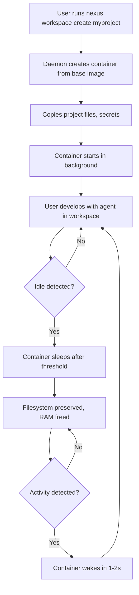

# Docker Workspace Management PRD

**Status:** Draft  
**Created:** 2026-02-22  
**Component:** Workspace (Phase 1)  
**Prerequisites:** Research from Sprites and opencode-devcontainers

---

## 1. Overview

### 1.1 Problem Statement

Current Nexus workspace management lacks container-based isolation and lifecycle control. Developers need:

- Full container-based development environments with persistent state
- Automatic resource management through idle detection (like Sprites)
- Integrated port management for services (like opencode-devcontainers)
- Seamless integration with Boulder enforcer for enforcement across workspaces

### 1.2 Goals

1. Provide full container-based workspace management with lifecycle control (start/stop/sleep/wake)
2. Implement auto-sleep on idle with configurable thresholds and fast wake-up
3. Deliver automatic port management with service discovery
4. Integrate with Boulder enforcer system for cross-workspace enforcement
5. Ensure persistent storage with secrets management

### 1.3 Non-Goals

- Remote Docker hosts (Phase 2)
- Multi-user workspace sharing (Phase 3)
- OCI image snapshots (covered in research report)

---

## 2. User Experience

### 2.1 Workflow



### 2.1 Backend Options

Nexus workspaces support multiple backends:

| Backend | Description | Requirements |
|---------|-------------|--------------|
| `docker` | Docker container-based workspaces | Docker daemon running |
| `sprite` | Sprite CLI-based workspaces | `sprite` CLI installed |

```bash
# Create workspace with Docker backend (default)
nexus workspace create myproject --backend docker

# Create workspace with Sprite backend
nexus workspace create myproject --backend sprite

# Verify backend availability
nexus workspace doctor
```

### 2.2 CLI Commands

| Command | Description |
|---------|-------------|
| `nexus workspace create <name> [--backend docker|sprite]` | Create new workspace with specified backend |
| `nexus workspace start <name>` | Start stopped container |
| `nexus workspace stop <name>` | Stop running container (sleep) |
| `nexus workspace delete <name>` | Remove container and data |
| `nexus workspace list` | List all workspaces with status |
| `nexus workspace use <name>` | Switch active workspace |
| `nexus workspace status <name>` | Show detailed status |
| `nexus workspace exec <name> <cmd>` | Execute command in workspace |
| `nexus workspace logs <name>` | View container logs |
| `nexus workspace config <name>` | Edit workspace configuration |
| `nexus workspace cleanup [--dry-run]` | Clean up old/stopped workspaces |
| `nexus serve [--port <port>]` | Start REST API server |

### 2.3 Examples

```bash
# Create new workspace with Docker backend (default)
nexus workspace create myproject

# Create new workspace with Sprite backend
nexus workspace create myproject --backend sprite

# List all workspaces
nexus workspace list
# Output:
# NAME        STATUS     IDLE    PORTS
# myproject   running    5m      3000->3000, 5173->5173
# old-project stopped    -       -

# Switch to workspace (sets NEXUS_WORKSPACE env)
nexus workspace use myproject

# Stop workspace (sleep)
nexus workspace stop myproject

# Start workspace (wake)
nexus workspace start myproject

# Delete workspace
nexus workspace delete myproject

# Execute command in workspace
nexus workspace exec myproject npm run build

# View logs
nexus workspace logs myproject --follow
```

---

## 3. Functional Requirements

### 3.1 Workspace Lifecycle

#### 3.1.1 Create

- **Input:** Workspace name (optional: base image, CPU/memory limits)
- **Process:**
  1. Generate unique workspace ID
  2. Create Docker volume for persistent storage
  3. Create container from base image (default: `nexus/workspace-base:latest`)
  4. Copy project files from current directory
  5. Copy secrets from `.nexus/secrets/` if exists
  6. Copy `.env` and gitignored files
  7. Start container in detached mode
  8. Allocate ports from configured range
  9. Register workspace in state store
- **Output:** Workspace ID, allocated ports, connection info

#### 3.1.2 Start

- **Input:** Workspace name or ID
- **Process:**
  1. Retrieve workspace configuration
  2. Start Docker container
  3. Restore port allocations
  4. Emit workspace ready event
- **Output:** Success/failure, time taken (~1-2s wake)

#### 3.1.3 Stop (Sleep)

- **Input:** Workspace name or ID
- **Process:**
  1. Save current state reference
  2. Stop container gracefully (SIGTERM, then SIGKILL after timeout)
  3. Preserve volume data
  4. Release port allocations (or preserve if configured)
  5. Update workspace status
- **Output:** Success/failure

#### 3.1.4 Delete

- **Input:** Workspace name or ID, optional `--force`
- **Process:**
  1. Stop container if running
  2. Remove container
  3. Remove volume (confirm if data exists)
  4. Remove from state store
  5. Release port allocations
- **Output:** Success/failure, space reclaimed

### 3.2 Sprite Backend (Alternative)

When `--backend sprite` is specified, Nexus uses the Sprite CLI instead of direct Docker API calls.

#### 3.2.1 Sprite Integration

- **Detection:** Check if `sprite` command is available on system
- **Verification:** Run `sprite doctor` to verify sprite is working
- **Configuration:** Use sprite's config file (`~/.config/sprite/config.yaml`)

#### 3.2.2 Sprite-Specific Commands

```bash
# Create workspace using sprite
sprite create myproject

# List sprite workspaces
sprite list

# Start workspace (wake)
sprite start myproject

# Stop workspace (sleep)
sprite stop myproject

# Delete workspace
sprite delete myproject

# Get workspace info
sprite info myproject

# Execute command in workspace
sprite exec myproject npm run dev
```

#### 3.2.3 Port Forwarding with Sprite

- **Auto-forward:** Sprite handles port forwarding automatically
- **Port discovery:** Query sprite for active port mappings
- **Integration:** Map sprite ports to Nexus workspace state

```bash
# Get forwarded ports
sprite ports myproject

# Forward additional port
sprite forward myproject 8080:8080
```

#### 3.2.4 Sprite Sleep/Wake Lifecycle

- **Sleep:** Uses `sprite stop` to gracefully pause workspace
- **Wake:** Uses `sprite start` to resume workspace
- **State:** Filesystem state preserved by sprite's volume management
- **Fast wake:** Sprite's optimized wake achieves ~1-2s startup

#### 3.2.5 Hybrid Mode

For maximum compatibility, Nexus can use both backends:
- **Primary:** Docker (default for full control)
- **Fallback:** Sprite (if Docker unavailable but sprite installed)
- **User choice:** Explicit `--backend` flag overrides auto-detection

### 3.3 Auto-Sleep on Idle

#### 3.3.1 Idle Detection

- **Trigger:** No active connections for configurable duration
- **Default:** 30 minutes
- **Configuration:** `idleTimeout` in workspace config (range: 5min - 24h)
- **Detection Method:**
  - No agent activity (file edits, terminal I/O)
  - No port traffic (HTTP requests, WebSocket connections)
  - No active user sessions

#### 3.3.2 Warm/Cold State Tracking

Workspaces can be in one of three states:

| State | Description | Resource Usage |
|-------|-------------|----------------|
| **Warm** | Active, running services, user present | Full RAM/CPU |
| **Idle** | No active sessions, services may be running | Reduced RAM |
| **Cold** | Stopped, filesystem only preserved | No RAM/CPU |

**State Transitions:**
- **Warm → Idle:** After `idleTimeout` with no activity
- **Idle → Cold:** After additional `coldTimeout` (default: 2x idleTimeout)
- **Cold → Warm:** On activity detection, services restart

#### 3.3.3 Activity Detection Methods

Activity detection monitors multiple signals:

1. **TCP Connections:** Monitor established connections to workspace ports
   ```bash
   # Check for active connections
   netstat -tn | grep :3000
   ss -tn | grep :3000
   ```

2. **TTY Sessions:** Detect active terminal sessions
   ```bash
   # Check for active TTY
   who | grep <workspace-user>
   ps -t pts/<n> -u <workspace-user>
   ```

3. **HTTP Requests:** Monitor HTTP traffic to workspace ports
   - Parse access logs
   - Monitor with `tcpdump` or similar
   - Check application-level health endpoints

4. **File System Activity:** Watch for file changes
   ```bash
   # Monitor file changes
   inotifywait -m /workspace &
   ```

#### 3.3.4 Service Auto-Restart on Wake

When waking from cold state, configured services restart automatically:

```yaml
# Workspace config
services:
  - name: "dev-server"
    command: "npm run dev"
    port: 3000
    autoStart: true
    restartDelay: 2s    # Wait before restarting
    
  - name: "database"
    command: "pg_ctl start"
    port: 5432
    autoStart: true
    dependsOn: ["dev-server"]
```

**Restart Process:**
1. Start container
2. Wait for container readiness (health check)
3. Start services in dependency order
4. Verify services are responding
5. Mark workspace as "warm"

#### 3.3.5 Sleep Process

- **Grace Period:** 60 seconds warning before sleep (configurable)
- **State Preserved:**
  - Filesystem (via Docker volume)
  - Git state
  - Terminal history
- **State Lost:**
  - RAM contents (processes, in-memory data)
  - Running servers/services

#### 3.3.6 Wake Process

- **Trigger:** Any activity detected
- **Wake Time:** ~1-2 seconds
- **Process:**
  1. Start container
  2. Restore environment
  3. Optionally restart background services
- **Configuration:** `autoRestartServices` flag

### 3.4 Port Management

#### 3.4.1 Port Allocation

- **Range:** Default 3000-3999 (configurable)
- **Strategy:** First available from range
- **Persistence:** Optional port locking per workspace
- **Conflict Resolution:** Auto-retry with next available port

#### 3.4.2 Port Forwarding

- **Host → Container:** All exposed container ports mapped to host
- **Service Discovery:** Workspace registers ports in coordination service
- **URL Format:** `http://localhost:<port>` or `http://<workspace-name>.localhost:<port>`

#### 3.4.3 Port Configuration

```yaml
# Workspace config
workspace:
  ports:
    autoAssign: true
    range:
      start: 3000
      end: 3999
    persistent: false  # Release ports on stop

  exposed:
    - port: 3000       # App dev server
      protocol: http
    - port: 5432        # Database
      protocol: tcp
```

### 3.5 Cleanup Requirements

#### 3.5.1 Automatic Cleanup

- **Trigger:** Scheduled cleanup runs daily (configurable)
- **Condition:** Workspace stopped for > 7 days
- **Action:** Delete workspace and associated resources
- **Warning:** Send notification 24h before cleanup

```yaml
# Global config
cleanup:
  enabled: true
  autoCleanupDays: 7        # Delete after 7 days of inactivity
  warningDays: 1            # Warn 1 day before deletion
  schedule: "0 3 * * *"    # Run at 3 AM daily
```

#### 3.5.2 Manual Cleanup Command

```bash
# List workspaces eligible for cleanup (dry run)
nexus workspace cleanup --dry-run

# Clean up stopped workspaces older than 7 days
nexus workspace cleanup

# Clean up specific workspace
nexus workspace cleanup myproject

# Force cleanup without warning
nexus workspace cleanup --force

# Clean up all resources including volumes
nexus workspace cleanup --all
```

#### 3.5.3 Orphaned Container Detection

Detect containers not managed by Nexus:

```bash
# Detect orphaned containers
nexus workspace cleanup --detect-orphans

# List orphaned resources
# - Containers without nexus labels
# - Volumes without nexus prefix
# - Networks without nexus prefix
```

#### 3.5.4 Resource Quota Enforcement

Enforce resource limits per user/workspace:

```yaml
# Global config
quotas:
  maxWorkspaces: 10         # Maximum workspaces per user
  maxStorage: "50g"        # Maximum storage per user
  maxRunning: 3            # Maximum running workspaces
  
  perWorkspace:
    maxCPU: "4"            # Maximum CPU per workspace
    maxMemory: "8g"        # Maximum memory per workspace
    maxDisk: "30g"         # Maximum disk per workspace
```

**Quota Enforcement:**
- Reject workspace creation when quota exceeded
- Warn when approaching limits
- Display usage in `nexus workspace list`

### 3.6 Integration with Enforcer

#### 3.6.1 Boulder Across Workspaces

- **State Location:** `.nexus/workspaces/<name>/boulder/` in volume
- **Configuration:** Per-workspace `.boulder.yaml`
- **Behavior:**
  - Enforcer runs in active workspace only
  - State persists across sleep/wake cycles
  - Can pause/resume per workspace

#### 3.6.2 Enforcer Commands

```bash
nexus workspace enforcer status myproject   # Check enforcer state
nexus workspace enforcer pause myproject    # Pause enforcement
nexus workspace enforcer resume myproject   # Resume enforcement
nexus workspace enforcer logs myproject     # View enforcement logs
```

### 3.7 Storage

#### 3.7.1 Volume Management

- **Type:** Docker named volume
- **Location:** `nexus_workspace_<workspace-id>`
- **Mount Points:**
  - `/workspace` - Project files
  - `/home/user` - User home (bash history, configs)

#### 3.7.2 Secrets Management

```bash
# Secrets directory structure
.nexus/
  secrets/
    id_ed25519          # SSH keys
    .npmrc              # NPM credentials
    .pypirc             # Python package credentials
  workspaces/
    <workspace-id>/
      config.yaml       # Workspace configuration
      state.json        # Runtime state
```

- **Copied on create:** All files from `.nexus/secrets/`
- **Preserved:** `.env`, gitignored files in project root
- **Excluded:** `.git/` directory (use Git instead)

### 3.8 Real Project Testing Requirements

Before declaring the workspace system ready for production, the following real-world tests must pass:

#### 3.8.1 Test Project: hanlun-lms

- **Repository:** `git@github.com:oursky/hanlun-lms.git`
- **Purpose:** Validate workspace works with a real production project

#### 3.8.2 Parallel Worktree Development Test

Test parallel development using Git worktrees:

```bash
# Create workspace for main branch
nexus workspace create hanlun-main --backend sprite
cd /path/to/hanlun-main
git worktree add ../hanlun-feature feature-branch

# Create workspace for feature branch  
nexus workspace create hanlun-feature --backend sprite

# Verify isolation - changes in one don't affect other
# Both workspaces should run independently
```

**Success Criteria:**
- [ ] Both workspaces start without conflicts
- [ ] Different branches are isolated
- [ ] Port conflicts resolved automatically
- [ ] Changes in one workspace don't affect another

#### 3.8.3 Feature Branch Implementation Test

Test complete feature workflow:

```bash
# 1. Clone/create workspace from hanlun-lms
nexus workspace create hanlun-lms --backend sprite

# 2. Create feature branch
nexus workspace exec hanlun-lms git checkout -b feature/test-workspace

# 3. Make changes (e.g., add tests, fix bug)
nexus workspace exec hanlun-lms npm test

# 4. Commit changes
nexus workspace exec hanlun-lms git add . && git commit -m "test: verify workspace"

# 5. Push to remote
nexus workspace exec hanlun-lms git push origin feature/test-workspace

# 6. Stop workspace (simulate end of day)
nexus workspace stop hanlun-lms

# 7. Next day - wake workspace and continue
nexus workspace start hanlun-lms
```

**Success Criteria:**
- [ ] Complete git workflow works in workspace
- [ ] npm packages install correctly
- [ ] Tests run successfully
- [ ] Workspace state persists across stop/start
- [ ] Fast wake time (~1-2 seconds)

#### 3.8.4 Frictionless Workflow Validation

**Metrics to measure:**
- Time to create workspace: < 30 seconds
- Time to wake workspace: < 2 seconds
- Time to install dependencies: Baseline (depends on project)
- Number of manual steps: 0 (fully automated)

**User Experience Test:**
1. User creates workspace → starts coding within 30 seconds
2. User stops workspace → returns next day
3. User wakes workspace → immediately productive
4. User switches branches → isolated environments
5. User runs tests → pass/fail clearly reported

### 3.9 opencode serve Integration

Use opencode serve for programmatic workspace management and testing.

#### 3.9.1 REST API Server

Start the Nexus REST API server:

```bash
# Start server on default port (4847)
nexus serve

# Start server on custom port
nexus serve --port 8080

# Start with API token authentication
nexus serve --token my-secret-token

# Start with CORS enabled for development
nexus serve --cors
```

#### 3.9.2 REST API Endpoints

| Method | Endpoint | Description |
|--------|----------|-------------|
| `GET` | `/api/workspaces` | List all workspaces |
| `POST` | `/api/workspaces` | Create new workspace |
| `GET` | `/api/workspaces/:name` | Get workspace details |
| `POST` | `/api/workspaces/:name/start` | Start workspace |
| `POST` | `/api/workspaces/:name/stop` | Stop workspace |
| `DELETE` | `/api/workspaces/:name` | Delete workspace |
| `GET` | `/api/workspaces/:name/logs` | Stream workspace logs |
| `POST` | `/api/workspaces/:name/exec` | Execute command |

#### 3.9.3 API Examples

```bash
# Create workspace via API
curl -X POST http://localhost:4847/api/workspaces \
  -H "Content-Type: application/json" \
  -d '{"name": "myproject", "backend": "sprite"}'

# Start workspace
curl -X POST http://localhost:4847/api/workspaces/myproject/start

# Execute command
curl -X POST http://localhost:4847/api/workspaces/myproject/exec \
  -H "Content-Type: application/json" \
  -d '{"command": "npm run build"}'

# Get workspace status
curl http://localhost:4847/api/workspaces/myproject
```

#### 3.9.4 End-to-End Testing via API

Use the REST API for automated testing:

```bash
# Test script for CI/CD
export API_URL="http://localhost:4847"

# 1. Create workspace
WORKSPACE_ID=$(curl -s -X POST $API_URL/api/workspaces \
  -d '{"name": "test-workspace", "backend": "sprite"}' | jq -r '.id')

# 2. Wait for ready
sleep 5

# 3. Run tests in workspace
curl -X POST $API_URL/api/workspaces/$WORKSPACE_ID/exec \
  -d '{"command": "npm test"}'

# 4. Get test results
curl $API_URL/api/workspaces/$WORKSPACE_ID/logs

# 5. Cleanup
curl -X DELETE $API_URL/api/workspaces/$WORKSPACE_ID
```

#### 3.9.5 WebSocket Events

For real-time updates:

```javascript
// Connect to WebSocket
const ws = new WebSocket('ws://localhost:4847/ws');

// Subscribe to events
ws.send(JSON.stringify({
  action: 'subscribe',
  events: ['workspace.created', 'workspace.started', 'workspace.stopped']
}));

// Receive events
ws.onmessage = (event) => {
  const data = JSON.parse(event.data);
  console.log('Event:', data.type, data.workspace_id);
};
```

---

## 4. Architecture

### 4.1 Components

```
┌─────────────────────────────────────────────────────────────────┐
│                         CLI Layer                               │
│                    (nexus CLI - Go/TS)                         │
└────────────────────────────┬────────────────────────────────────┘
                             │ gRPC/WebSocket
                             ▼
┌─────────────────────────────────────────────────────────────────┐
│                    Workspace Daemon                             │
│  ┌─────────────┐  ┌─────────────┐  ┌─────────────────────────┐  │
│  │ Lifecycle   │  │ Port        │  │ State                   │  │
│  │ Manager     │  │ Manager     │  │ Store                   │  │
│  └─────────────┘  └─────────────┘  └─────────────────────────┘  │
└────────────────────────────┬────────────────────────────────────┘
                             │ Docker API
                             ▼
┌─────────────────────────────────────────────────────────────────┐
│                      Docker Engine                              │
│  ┌─────────────┐  ┌─────────────┐  ┌─────────────────────────┐  │
│  │ Container   │  │ Volume      │  │ Network                │  │
│  └─────────────┘  └─────────────┘  └─────────────────────────┘  │
└─────────────────────────────────────────────────────────────────┘
```

### 4.2 Workspace Daemon

**Purpose:** Long-running service managing all workspace containers

**Responsibilities:**
- Container lifecycle (create, start, stop, delete)
- Port allocation and forwarding
- Idle detection and sleep orchestration
- State persistence
- Event emission

**Communication:**
- gRPC API for CLI commands
- WebSocket for real-time status updates
- Unix socket for local communication (optional)

### 4.3 State Store

**Location:** `.nexus/workspaces/` in user's home directory

**Files:**
```
.nexus/
  workspaces/
    index.json              # Workspace registry
    <workspace-id>/
      config.yaml           # Workspace configuration
      state.json            # Runtime state
      logs/                 # Container logs
```

### 4.4 Event System

| Event | Payload | Consumers |
|-------|---------|-----------|
| `workspace.created` | `{id, name, ports}` | CLI, UI |
| `workspace.started` | `{id, name, duration}` | CLI, UI |
| `workspace.stopped` | `{id, name, reason}` | CLI, UI |
| `workspace.sleeping` | `{id, name, warning}` | CLI, UI |
| `workspace.waking` | `{id, name}` | CLI, UI |
| `workspace.deleted` | `{id, name}` | CLI, UI |
| `idle.detected` | `{id, name, idleTime}` | Enforcer |
| `activity.detected` | `{id, name}` | Enforcer |

---

## 5. Configuration

### 5.1 Global Configuration

**Location:** `~/.nexus/config.yaml`

```yaml
workspace:
  # Base image for new workspaces
  baseImage: "nexus/workspace-base:latest"
  
  # Port allocation
  ports:
    range:
      start: 3000
      end: 3999
    persistent: false
  
  # Idle detection
  idleTimeout: 30m
  sleepWarning: 60s
  autoWake: true
  
  # Resource limits
  defaults:
    cpu: "2"
    memory: "4g"
    disk: "20g"
  
  # Storage
  dataDir: "~/.nexus/workspaces"
  logsDir: "~/.nexus/logs"

daemon:
  socket: "/tmp/nexus-daemon.sock"
  port: 4847
  logLevel: "info"
```

### 5.2 Workspace Configuration

**Location:** `.nexus/workspaces/<id>/config.yaml`

```yaml
name: "myproject"
id: "ws_abc123"

image: "nexus/workspace-base:latest"

resources:
  cpu: "2"
  memory: "4g"
  disk: "20g"

ports:
  exposed:
    - port: 3000
      protocol: http
    - port: 5173
      protocol: http
  
  autoAssign: true

idle:
  timeout: 30m
  warning: 60s
  autoRestartServices: true

services:
  - name: "dev-server"
    command: "npm run dev"
    port: 3000
    autoStart: true
```

---

## 6. API Specification

### 6.1 gRPC API

```protobuf
service WorkspaceService {
  rpc Create(CreateRequest) returns (CreateResponse);
  rpc Start(StartRequest) returns (StartResponse);
  rpc Stop(StopRequest) returns (StopResponse);
  rpc Delete(DeleteRequest) returns (DeleteResponse);
  rpc List(ListRequest) returns (ListResponse);
  rpc Get(GetRequest) returns (GetResponse);
  rpc Exec(ExecRequest) returns (ExecResponse);
  rpc Watch(WatchRequest) returns (stream WatchResponse);
}

message Workspace {
  string id = 1;
  string name = 2;
  string status = 3;  // created, running, stopped, sleeping, error
  string image = 4;
  Resources resources = 5;
  repeated PortMapping ports = 6;
  int64 created_at = 7;
  int64 last_activity = 8;
}

message CreateRequest {
  string name = 1;
  string image = 2;
  Resources resources = 3;
}

message CreateResponse {
  Workspace workspace = 1;
}
```

### 6.2 WebSocket API

```typescript
interface WorkspaceEvent {
  type: string;
  workspace_id: string;
  timestamp: number;
  payload: unknown;
}

// Client subscribes to events
ws.send(JSON.stringify({
  action: 'subscribe',
  events: ['workspace.created', 'workspace.started', 'idle.detected']
}));

// Server emits events
ws.on('message', (event: WorkspaceEvent) => {
  console.log(event);
});
```

---

## 7. Acceptance Criteria

### 7.1 Workspace Lifecycle

- [ ] `nexus workspace create` creates container with project files in < 30 seconds
- [ ] `nexus workspace start` starts stopped container in < 5 seconds
- [ ] `nexus workspace stop` gracefully stops container preserving filesystem
- [ ] `nexus workspace delete` removes container and volume with confirmation
- [ ] `nexus workspace list` shows all workspaces with accurate status

### 7.2 Auto-Sleep

- [ ] Workspace sleeps after 30 minutes of inactivity (default)
- [ ] 60-second warning before sleep
- [ ] Wake time is < 3 seconds
- [ ] Filesystem state preserved after sleep
- [ ] RAM/processes not preserved after sleep

### 7.3 Port Management

- [ ] Ports automatically allocated from configured range
- [ ] Port conflicts resolved automatically
- [ ] Ports mapped correctly host ↔ container
- [ ] Port status visible in workspace list

### 7.4 Enforcer Integration

- [ ] Boulder state persists in workspace volume
- [ ] `nexus workspace use` switches active workspace
- [ ] Enforcer can be paused/resumed per workspace

### 7.5 Storage

- [ ] Project files persist across sleep/wake
- [ ] Secrets copied from `.nexus/secrets/` on create
- [ ] `.env` and gitignored files preserved

---

## 8. Open Questions

### 8.1 Configuration Format

**Question:** Should we support `devcontainer.json` (VS Code standard) or use custom YAML configuration?

**Options:**
1. **Custom YAML only** - Full flexibility, Nexus-specific
2. **devcontainer.json with extensions** - Broader compatibility
3. **Both** - devcontainer.json for compatibility, custom for advanced features

**Recommendation:** Start with custom YAML, add devcontainer.json compatibility layer in Phase 2.

### 8.2 Local vs Remote Docker

**Question:** Should we support remote Docker hosts (Docker Machine, remote Docker API)?

**Options:**
1. **Local Docker only (Phase 1)** - Simpler, faster
2. **Remote Docker (Phase 1)** - Full flexibility
3. **Local first, remote later (Phased)** - Incremental approach

**Recommendation:** Phase 1 - Local Docker only. Add remote Docker support in Phase 2 based on user demand.

### 8.3 Resource Limits

**Question:** What default resource limits should we impose per workspace?

**Options:**
1. **Unlimited** - User controls via Docker
2. **Fixed defaults** - 2 CPU, 4GB RAM, 20GB disk
3. **Configurable with limits** - User can configure within bounds

**Recommendation:** Configurable with sensible defaults (2 CPU, 4GB RAM, 20GB disk) and maximum limits (8 CPU, 16GB RAM, 100GB disk).

### 8.4 Base Image Strategy

**Question:** How should we handle base images for workspaces?

**Options:**
1. **Single default image** - Simpler, opinionated
2. **Multiple preset images** - Node, Python, Go, Rust, etc.
3. **Custom images** - User provides Dockerfile or image name

**Recommendation:** Single default `nexus/workspace-base:latest` with documentation for custom images.

---

## 9. Implementation Roadmap

### Phase 1: Core (Weeks 1-2)

- [ ] Workspace daemon with gRPC API
- [ ] Docker container lifecycle (create, start, stop, delete)
- [ ] Basic port allocation
- [ ] CLI commands
- [ ] State persistence

### Phase 2: Idle Management (Week 3)

- [ ] Idle detection system
- [ ] Auto-sleep on idle
- [ ] Fast wake-up
- [ ] Warning notifications

### Phase 3: Integration (Week 4)

- [ ] Boulder integration
- [ ] WebSocket event system
- [ ] Configuration management
- [ ] Secrets handling

### Phase 4: Polish (Week 5)

- [ ] Logging and debugging tools
- [ ] Error handling and recovery
- [ ] Performance optimization
- [ ] Documentation

---

## 10. References

- [Sprites](https://github.com/ageron/sprites) - Docker-based dev environments with idle management
- [opencode-devcontainers](https://github.com/anomalyco/opencode-devcontainers) - Dev container configuration
- [Docker Engine API](https://docs.docker.com/engine/api/)
- [devcontainer.json Reference](https://code.visualstudio.com/docs/devcontainers/devcontainerjson-reference)
- [OCI Image Spec](https://github.com/opencontainers/image-spec)

---

## 11. Appendix

### A. Error Codes

| Code | Meaning | Resolution |
|------|---------|------------|
| `WS001` | Container creation failed | Check Docker daemon, image exists |
| `WS002` | Container start failed | Check resources, ports |
| `WS003` | Container stop timeout | Force stop with --force |
| `WS004` | Port allocation failed | Increase port range |
| `WS005` | Volume mount failed | Check permissions |
| `WS006` | Workspace not found | Check name/ID |

### B. Environment Variables

| Variable | Description |
|----------|-------------|
| `NEXUS_WORKSPACE` | Active workspace name |
| `NEXUS_WORKSPACE_ID` | Active workspace ID |
| `NEXUS_WORKSPACE_PORTS` | Comma-separated port mappings |
| `NEXUS_DAEMON_SOCKET` | Daemon Unix socket path |
| `NEXUS_DAEMON_HOST` | Daemon HTTP host |

### C. File Structure

```
~/.nexus/
├── config.yaml
├── workspaces/
│   ├── index.json
│   └── ws_xxx/
│       ├── config.yaml
│       ├── state.json
│       └── logs/
├── secrets/           # Copied to each workspace
└── cache/

<project>/
├── .nexus/            # Workspace-local config (committed)
│   └── config.yaml
└── ...project files...
```
