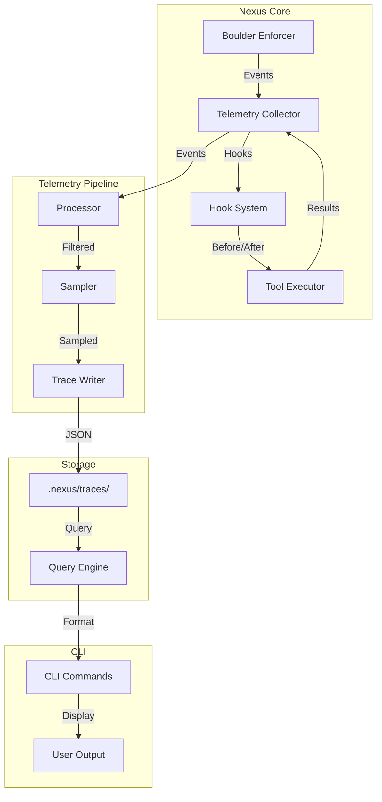
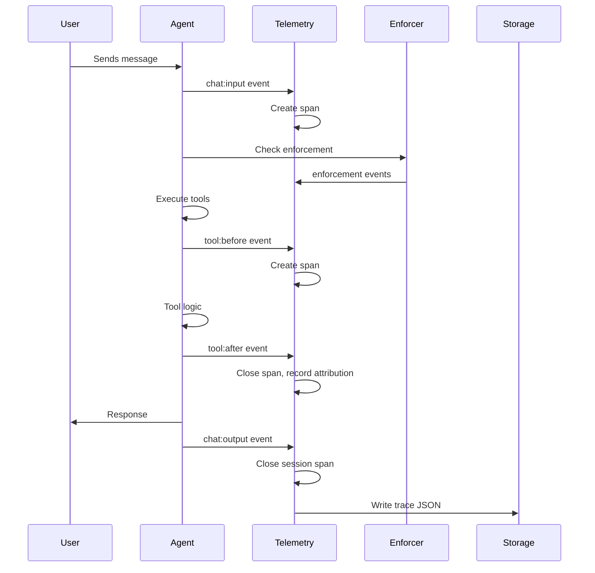

# Agent Trace Telemetry PRD

**Status:** Draft  
**Created:** 2026-02-22  
**Component:** Telemetry  
**Prerequisites:** Agent Trace specification (https://agent-trace.dev/), Boulder Enforcer

---

## 1. Overview

### 1.1 Problem Statement

As AI agents become more autonomous in writing code, developers need visibility into:
- What code was generated by AI versus humans
- How agents make decisions and take actions
- The complete workflow of agent sessions
- Error patterns and recovery behaviors

Current Nexus lacks telemetry infrastructure to capture this data, making it difficult to:
- Understand agent behavior and improve transparency
- Debug issues when agents produce unexpected results
- Track AI attribution for code audit and compliance
- Measure agent effectiveness and identify friction points

### 1.2 Goals

1. **Attribution Tracking**: Implement Agent Trace specification for tracking AI-generated code contributions with line-level granularity
2. **Behavior Telemetry**: Capture agent actions, decisions, and outcomes through spans and events
3. **Session Tracing**: Track complete agent sessions from start to finish with context propagation
4. **Local Storage**: Provide local trace storage with JSON format compatible with Agent Trace spec
5. **CLI Integration**: Enable trace inspection through CLI commands
6. **Privacy Controls**: Implement PII scrubbing and configurable sampling

### 1.3 Non-Goals

- Real-time streaming to external systems (Phase 2)
- Web dashboard (Phase 3)
- Code quality assessment
- Legal ownership tracking
- Training data provenance

---

## 2. Architecture

### 2.1 System Architecture



### 2.2 Core Components

| Component | Responsibility |
|-----------|----------------|
| `TelemetryCollector` | Central hub for collecting events from all sources |
| `HookSystem` | Manages before/after hooks for tool execution |
| `Processor` | Enriches events with context and attributes |
| `Sampler` | Samples events based on configuration |
| `TraceWriter` | Persists traces to local storage |
| `QueryEngine` | Queries and filters stored traces |

### 2.3 Data Model

The telemetry system combines two specifications:

1. **Agent Trace** (attribution): Track AI contributions to code
2. **OpenTelemetry-inspired** (telemetry): Track agent behavior

```typescript
interface Trace {
  id: string;                    // UUID
  version: string;                // Agent Trace spec version (e.g., "0.1.0")
  timestamp: string;              // RFC 3339
  session_id: string;             // Nexus session identifier
  
  // Agent Trace fields
  vcs?: VCS;
  tool?: Tool;
  files: FileAttribution[];
  
  // Telemetry fields
  spans: Span[];
  metadata: Record<string, unknown>;
}

interface VCS {
  type: 'git' | 'jj' | 'hg' | 'svn';
  revision: string;
}

interface Tool {
  name: string;
  version: string;
}

interface FileAttribution {
  path: string;
  conversations: Conversation[];
}

interface Conversation {
  url?: string;                   // Conversation reference
  contributor: Contributor;
  ranges: Range[];
  related?: RelatedResource[];
}

interface Contributor {
  type: 'human' | 'ai' | 'mixed' | 'unknown';
  model_id?: string;              // e.g., "anthropic/claude-sonnet-4-20250514"
}

interface Range {
  start_line: number;
  end_line: number;
  content_hash?: string;
  contributor?: Contributor;     // Override for this range
}

interface RelatedResource {
  type: string;
  url: string;
}

interface Span {
  id: string;
  parent_id?: string;
  name: string;
  type: SpanType;
  start_time: number;            // Unix timestamp (ms)
  end_time?: number;
  attributes: Record<string, unknown>;
  events: SpanEvent[];
  status: SpanStatus;
}

type SpanType = 
  | 'tool.execute'
  | 'enforcement.idle'
  | 'enforcement.message'
  | 'decision'
  | 'error'
  | 'session.start'
  | 'session.end'
  | 'chat.input'
  | 'chat.output';

interface SpanEvent {
  name: string;
  timestamp: number;
  attributes?: Record<string, unknown>;
}

type SpanStatus = 'ok' | 'error' | 'unset';
```

---

## 3. Features

### 3.1 Automatic Trace Collection

The system automatically captures traces through hook points:

| Hook Point | Captured Data |
|------------|---------------|
| `tool.execute.before` | Tool name, arguments, invocation context |
| `tool.execute.after` | Tool result, duration, success/failure |
| `enforcement.idle` | Idle detection events, idle duration |
| `enforcement.message` | Enforcement message content, trigger |
| `chat.input` | User messages, session context |
| `chat.output` | AI responses, model used |
| `session.start` | Session metadata, workspace context |
| `session.end` | Session summary, outcome |

### 3.2 Span Types

#### 3.2.1 Tool Execution Span

```json
{
  "id": "span-001",
  "name": "tool.execute:read",
  "type": "tool.execute",
  "start_time": 1700000000000,
  "end_time": 1700000000150,
  "attributes": {
    "tool.name": "read",
    "tool.category": "file",
    "args.filePath": "/path/to/file.ts",
    "args.limit": 100,
    "result.lines": 50,
    "result.truncated": false
  },
  "events": [],
  "status": "ok"
}
```

#### 3.2.2 Enforcement Spans

```json
{
  "id": "span-002",
  "name": "enforcement.idle",
  "type": "enforcement.idle",
  "start_time": 1700000000000,
  "end_time": 1700000030000,
  "attributes": {
    "idle.duration_ms": 30000,
    "idle.threshold_ms": 30000,
    "idle.count": 1,
    "action": "warn"
  },
  "events": [
    {
      "name": "idle.warning",
      "timestamp": 1700000025000,
      "attributes": { "message": "You've been idle for 25 seconds" }
    }
  ],
  "status": "ok"
}
```

```json
{
  "id": "span-003",
  "name": "enforcement.message",
  "type": "enforcement.message",
  "start_time": 1700000000000,
  "end_time": 1700000000100,
  "attributes": {
    "message.type": "workflow_reminder",
    "message.priority": "high",
    "trigger": "workflow_incomplete"
  },
  "events": [],
  "status": "ok"
}
```

#### 3.2.3 Decision Span

```json
{
  "id": "span-004",
  "name": "decision:code_implementation",
  "type": "decision",
  "start_time": 1700000000000,
  "end_time": 1700000005000,
  "attributes": {
    "decision.type": "implementation_approach",
    "decision.options": ["option_a", "option_b", "option_c"],
    "decision.selected": "option_b",
    "decision.reasoning": "Best balance of performance and maintainability",
    "context.files_affected": 3,
    "context.lines_changed": 150
  },
  "events": [],
  "status": "ok"
}
```

#### 3.2.4 Error Span

```json
{
  "id": "span-005",
  "name": "error:file_not_found",
  "type": "error",
  "start_time": 1700000000000,
  "end_time": 170000000050,
  "attributes": {
    "error.code": "ENOENT",
    "error.message": "File not found: /path/to/missing.ts",
    "error.stack": "Error: File not found...",
    "recovery.action": "graceful_degradation",
    "recovery.success": true
  },
  "events": [
    {
      "name": "error.recovery_attempt",
      "timestamp": 1700000000040,
      "attributes": { "attempt": 1, "strategy": "search_alternatives" }
    }
  ],
  "status": "error"
}
```

### 3.3 Agent Trace Attribution

#### 3.3.1 Tracking AI Contributions

When tools modify files, the system tracks attribution:

```typescript
interface FileChange {
  path: string;
  before_lines: number;
  after_lines: number;
  diff: DiffChunk[];
}

interface DiffChunk {
  start_line: number;
  end_line: number;
  type: 'added' | 'modified' | 'deleted' | 'unchanged';
  content?: string;
}
```

The attribution system:
1. Captures file state before tool execution
2. Captures file state after tool execution
3. Computes diff to identify changed ranges
4. Associates changes with the active conversation/contributor

#### 3.3.2 Contributor Types

| Type | Code | Description |
|------|------|-------------|
| Human | `human` | Code authored directly by a developer |
| AI | `ai` | Code generated by AI model |
| Mixed | `mixed` | Human-edited AI output or AI-edited human code |
| Unknown | `unknown` | Origin cannot be determined |

#### 3.3.3 Model Identifier Format

Model identifiers follow [models.dev](https://models.dev) convention:

```
anthropic/claude-opus-4-5-20251101
openai/gpt-4o
google/gemini-2.0-flash
```

### 3.4 Context Propagation

Trace context propagates across operations:

```typescript
interface TraceContext {
  trace_id: string;
  span_id: string;
  trace_flags: number;  // 0 = unset, 1 = sampled
}

// Propagated via:
// - HTTP headers (W3C Trace Context)
// - Process environment
// - Message passing
```

---

## 4. Storage & Export

### 4.1 Local Storage

Traces stored in `.nexus/traces/` directory:

```
.nexus/
└── traces/
    ├── 2026-02-22/
    │   ├── trace-a1b2c3d4.json
    │   ├── trace-e5f6g7h8.json
    │   └── ...
    ├── 2026-02-23/
    │   └── ...
    └── index.json           # Index for fast querying
```

### 4.2 Trace File Format

```json
{
  "version": "0.1.0",
  "id": "550e8400-e29b-41d4-a716-446655440000",
  "timestamp": "2026-02-22T14:30:00Z",
  "session_id": "sess-abc123",
  "vcs": {
    "type": "git",
    "revision": "a1b2c3d4e5f6a7b8c9d0e1f2a3b4c5d6e7f8a9b0"
  },
  "tool": {
    "name": "nexus",
    "version": "0.1.0"
  },
  "files": [
    {
      "path": "src/utils/parser.ts",
      "conversations": [
        {
          "url": "https://api.nexus.dev/v1/sessions/sess-abc123/messages/5",
          "contributor": {
            "type": "ai",
            "model_id": "anthropic/claude-sonnet-4-20250514"
          },
          "ranges": [
            { "start_line": 42, "end_line": 67 }
          ]
        }
      ]
    }
  ],
  "spans": [
    {
      "id": "span-001",
      "name": "tool.execute:read",
      "type": "tool.execute",
      "start_time": 1700000000000,
      "end_time": 1700000000150,
      "attributes": { ... },
      "events": [],
      "status": "ok"
    }
  ],
  "metadata": {
    "nexus": {
      "workspace_id": "ws-xyz789",
      "enforcer_enabled": true
    }
  }
}
```

### 4.3 Index Structure

```json
// .nexus/traces/index.json
{
  "version": 1,
  "last_updated": "2026-02-22T15:00:00Z",
  "traces": [
    {
      "id": "550e8400-e29b-41d4-a716-446655440000",
      "timestamp": "2026-02-22T14:30:00Z",
      "session_id": "sess-abc123",
      "file_count": 3,
      "span_count": 15,
      "outcome": "success",
      "duration_ms": 125000
    }
  ]
}
```

### 4.4 Export Formats

| Format | Description | Use Case |
|--------|-------------|----------|
| `agent-trace` | Agent Trace JSON (default) | Compliance, attribution |
| `otlp-json` | OpenTelemetry JSON | External OTLP receivers |
| `jaeger` | Jaeger Thrift | Jaeger UI |
| `zipkin` | Zipkin JSON | Zipkin UI |

### 4.5 Retention Policy

Default retention: 30 days

| Configuration | Value |
|---------------|-------|
| Default | 30 days |
| Minimum | 1 day |
| Maximum | 365 days |
| Cleanup | Daily at 03:00 UTC |

---

## 5. CLI Commands

### 5.1 Trace Management

| Command | Description |
|---------|-------------|
| `nexus trace list [--limit N] [--from DATE] [--to DATE] [--type TYPE]` | List traces |
| `nexus trace show <trace_id>` | Show trace details |
| `nexus trace show <trace_id> --spans` | Show trace with spans |
| `nexus trace show <trace_id> --attribution` | Show attribution details |
| `nexus trace export <trace_id> --format FORMAT --output FILE` | Export trace |
| `nexus trace delete <trace_id>` | Delete a trace |
| `nexus trace prune [--older-than DAYS]` | Prune old traces |
| `nexus trace stats` | Show storage statistics |

### 5.2 Query Examples

```bash
# List last 10 traces
nexus trace list --limit 10

# List traces from today
nexus trace list --from today

# List traces from the last week
nexus trace list --from -7d

# List traces with errors
nexus trace list --type error

# Show specific trace with spans
nexus trace show 550e8400-e29b-41d4-a716-446655440000 --spans

# Show attribution details
nexus trace show 550e8400-e29b-41d4-a716-446655440000 --attribution

# Export to Jaeger format
nexus trace export 550e8400-e29b-41d4-a716-446655440000 \
  --format jaeger \
  --output trace.jaeger.json

# Delete old traces
nexus trace prune --older-than 30

# Show storage stats
nexus trace stats
```

### 5.3 Output Format

```bash
$ nexus trace list --limit 5

DATE/TIME            TRACE ID                              DURATION   SPANS   OUTCOME
2026-02-22 14:30    550e8400-e29b-41d4-a716-446655440000  2m 5s     15      success
2026-02-22 14:25    551a9501-f30c-52e5-b827-557766551111  45s       8       success
2026-02-22 14:20    552bb612-g41d-63f6-c938-668877662222  1m 30s    12      error
2026-02-22 14:15    553cc723-h52e-74g7-d049-779988773333  3m 20s    22      success
2026-02-22 14:10    554dd834-i63f-85h8-e150-880099884444  58s       9       success
```

```bash
$ nexus trace show 550e8400-e29b-41d4-a716-446655440000

Trace: 550e8400-e29b-41d4-a716-446655440000
Session: sess-abc123
Started: 2026-02-22T14:30:00Z
Duration: 2m 5s
Outcome: success

Spans (15 total):
  ✓ tool.execute:read (150ms)
  ✓ tool.execute:edit (230ms)
  ✓ tool.execute:glob (45ms)
  ✓ decision:implementation (500ms)
  ✓ enforcement.idle (30s)
  ✓ chat.output (1.2s)
  ... (9 more)

Files Modified (3):
  src/utils/parser.ts (AI: lines 42-67)
  src/components/Button.tsx (AI: lines 1-25, Human: lines 26-30)
  tests/parser.test.ts (AI: lines 50-100)
```

---

## 6. Integration Points

### 6.1 Boulder Enforcer Integration

```typescript
// Hook into BoulderEnforcer events
interface EnforcerEvents {
  'enforcer:idle_detected': (event: IdleEvent) => void;
  'enforcer:message_sent': (event: MessageEvent) => void;
  'enforcer:workflow_start': (event: WorkflowEvent) => void;
  'enforcer:workflow_complete': (event: WorkflowEvent) => void;
  'enforcer:enforcement_action': (event: EnforcementActionEvent) => void;
}
```

### 6.2 Tool Execution Hooks

```typescript
// Hook into tool execution
interface ToolHooks {
  'tool:execute:before': (context: ToolContext) => void;
  'tool:execute:after': (context: ToolContext, result: ToolResult) => void;
  'tool:execute:error': (context: ToolContext, error: Error) => void;
}
```

### 6.3 Chat Integration

```typescript
// Hook into chat messages
interface ChatHooks {
  'chat:input': (message: ChatMessage) => void;
  'chat:output': (message: ChatMessage) => void;
  'chat:turn': (turn: ChatTurn) => void;
}
```

### 6.4 Event Flow



---

## 7. Configuration

### 7.1 Configuration File

`~/.nexus/config.yaml`:

```yaml
telemetry:
  enabled: true
  sampling:
    rate: 100          # 1%, 10%, 100%
    session_rate: 100  # Session-level sampling
  retention:
    days: 30
    max_traces: 10000
  storage:
    path: ~/.nexus/traces
    format: json
  export:
    enabled: false
    endpoint: ""       # e.g., "http://localhost:4318/v1/traces"
    format: agent-trace
  privacy:
    scrub_pii: true
    scrub_patterns:
      - pattern: '\b\d{3}-\d{2}-\d{4}\b'
        replacement: "[SSN]"
      - pattern: '\b[A-Za-z0-9._%+-]+@[A-Za-z0-9.-]+\.[A-Z|a-z]{2,}\b'
        replacement: "[EMAIL]"
    exclude_paths:
      - ~/.ssh/*
      - ~/.aws/credentials
      - ~/.npm/_auth
  attribution:
    enabled: true
    auto_detect: true
    model_mapping:
      claude: anthropic/claude-*
      gpt: openai/gpt-*
      gemini: google/gemini-*
```

### 7.2 Environment Variables

| Variable | Description | Default |
|----------|-------------|---------|
| `NEXUS_TELEMETRY_ENABLED` | Enable/disable telemetry | `true` |
| `NEXUS_TELEMETRY_PATH` | Storage path | `~/.nexus/traces` |
| `NEXUS_TELEMETRY_SAMPLING` | Sampling rate | `100` |
| `NEXUS_TRACE_EXPORT_URL` | Export endpoint | (none) |

### 7.3 CLI Flags

```bash
# Disable telemetry for a session
nexus --no-telemetry run

# Override sampling rate
nexus --telemetry-sampling=10 run

# Export traces to external system
nexus trace export <id> --endpoint http://localhost:4318
```

---

## 8. Privacy & Performance

### 8.1 PII Scrubbing

The system scrubs PII by default:

| Pattern | Replacement | Example |
|---------|-------------|---------|
| SSN | `[SSN]` | `123-45-6789` → `[SSN]` |
| Email | `[EMAIL]` | `user@example.com` → `[EMAIL]` |
| API Key | `[API_KEY]` | `sk-xxx` → `[API_KEY]` |
| File path (excluded) | (redacted) | Paths in `exclude_paths` |

### 8.2 Sampling Options

| Rate | Description | Use Case |
|------|-------------|----------|
| `1%` | Sample 1 in 100 traces | Production, high volume |
| `10%` | Sample 1 in 10 traces | Normal operation |
| `100%` | All traces | Development/debugging |

### 8.3 Async Writing

Trace writing is asynchronous to avoid blocking:

```typescript
// Write buffer with batch flush
class TraceWriter {
  private buffer: Trace[] = [];
  private flushInterval = 5000; // 5 seconds
  
  async write(trace: Trace): Promise<void> {
    this.buffer.push(trace);
    
    if (this.buffer.length >= 100) {
      await this.flush();
    }
  }
  
  private async flush(): Promise<void> {
    // Write batch to disk
    // Runs in background
  }
}
```

### 8.4 Performance Targets

| Metric | Target |
|--------|--------|
| Trace overhead | < 10ms per span |
| Write latency | < 50ms (async) |
| Storage per 1000 traces | ~50MB |
| Query latency | < 100ms |

---

## 9. Implementation Plan

### 9.1 Phase 1: Core Infrastructure (Week 1-2)

- [ ] Create telemetry package structure
- [ ] Implement Trace, Span, Event data models
- [ ] Build TelemetryCollector service
- [ ] Implement trace storage (JSON files)
- [ ] Add basic configuration support

### 9.2 Phase 2: Hook Integration (Week 3)

- [ ] Integrate with Boulder Enforcer events
- [ ] Add tool execution hooks
- [ ] Implement session lifecycle tracking
- [ ] Add chat input/output hooks

### 9.3 Phase 3: Attribution (Week 4)

- [ ] Implement file diff tracking
- [ ] Build contributor attribution logic
- [ ] Add model identifier mapping
- [ ] Implement PII scrubbing

### 9.4 Phase 4: CLI (Week 5)

- [ ] Implement `nexus trace list`
- [ ] Implement `nexus trace show`
- [ ] Implement `nexus trace export`
- [ ] Implement `nexus trace prune`

### 9.5 Phase 5: Export & Polish (Week 6)

- [ ] Add Jaeger/Zipkin export
- [ ] Implement retention policy
- [ ] Add sampling configuration
- [ ] Performance optimization

---

## 10. Future Considerations

### 10.2 Phase 2 (Future)

- Real-time streaming to external systems
- gRPC-based export protocol
- Advanced query capabilities

### 10.3 Phase 3 (Future)

- Web-based trace viewer
- Timeline visualization
- Attribution heatmaps

### 10.4 External Integrations

| System | Format | Status |
|--------|--------|--------|
| Jaeger | Thrift | Planned |
| Zipkin | JSON | Planned |
| OTLP | Protobuf | Planned |
| Prometheus | Metrics | Considered |

---

## 11. Appendix

### A. Minimal Trace Record

```json
{
  "version": "0.1.0",
  "id": "550e8400-e29b-41d4-a716-446655440000",
  "timestamp": "2026-02-22T10:00:00Z",
  "session_id": "sess-abc123",
  "files": [
    {
      "path": "src/app.ts",
      "conversations": [
        {
          "contributor": { "type": "ai" },
          "ranges": [{ "start_line": 1, "end_line": 50 }]
        }
      ]
    }
  ],
  "spans": [],
  "metadata": {}
}
```

### B. MIME Types

| Type | MIME Type |
|------|-----------|
| Trace Record | `application/vnd.agent-trace.record+json` |
| Span | `application/vnd.agent-trace.span+json` |

### C. Error Codes

| Code | Description |
|------|-------------|
| `TRACE_NOT_FOUND` | Trace ID does not exist |
| `STORAGE_ERROR` | Failed to write/read trace |
| `INVALID_TRACE` | Trace schema validation failed |
| `RETENTION_ERROR` | Failed to prune old traces |

### D. References

- [Agent Trace Specification](https://agent-trace.dev/)
- [OpenTelemetry Trace Specification](https://opentelemetry.io/docs/specs/otel/trace/)
- [W3C Trace Context](https://www.w3.org/TR/trace-context/)
- [models.dev](https://models.dev)

---

## 12. Open Questions

1. **Attribution granularity**: Should we track at line level or character level?
2. **Conversation association**: How to reliably link file changes to conversations?
3. **Mixed contributions**: How to handle files with both AI and human changes?
4. **External tool attribution**: How to attribute code from tools called by agents?
5. **Retention enforcement**: How to handle storage limits vs. retention period?
