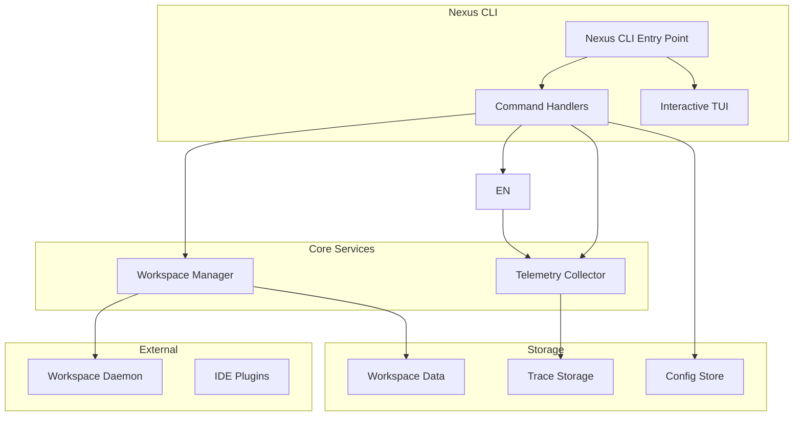

# Nexus CLI PRD

**Status:** Draft  
**Created:** 2026-02-22  
**Component:** CLI  
**Prerequisites:** Workspace Daemon, Telemetry System

---

## 1. Overview

### 1.1 Problem Statement

Currently, Nexus functionality is scattered across multiple entry points:

- IDE plugins (OpenCode, Claude Code, Cursor) for IDE integration
- Workspace operations require direct daemon interaction
- No unified command interface for users

This fragmentation creates several issues:

- Users must remember multiple commands and tools
- Inconsistent command patterns across interfaces
- Difficult to script and automate workflows
- No single source of truth for Nexus operations

### 1.2 Goals

1. **Unified Interface**: Single `nexus` CLI replacing all existing entry points
2. **Consistent UX**: Docker/kubectl-style subcommand structure
3. **Interactive Mode**: TUI for real-time workspace monitoring and quick actions
4. **Scripting Support**: JSON output, idempotent operations, exit codes for CI/CD
5. **Auto-Updates**: Seamless version updates without manual intervention

### 1.3 Non-Goals

- Replace IDE plugins (they remain as primary IDE integration)
- Support for remote workspaces via SSH (Phase 2)
- Web dashboard (separate project)
- Multi-user server mode (local-only CLI)

---

## 2. Architecture

### 2.1 System Architecture



### 2.2 Package Structure

```
packages/nexus-cli/
├── bin/
│   └── nexus                 # Entry point
├── src/
│   ├── index.ts              # Main CLI entry
│   ├── commands/             # Command implementations
│   │   ├── workspace/
│   │   ├── trace/
│   │   ├── plugin/
│   │   └── config/
│   ├── components/           # Reusable components
│   │   ├── TUI/
│   │   ├── formatter/
│   │   └── validator/
│   ├── services/             # Business logic
│   │   ├── WorkspaceService.ts
│   │   ├── EnforcerService.ts
│   │   ├── ConfigService.ts
│   │   └── TelemetryService.ts
│   ├── hooks/                # Lifecycle hooks
│   └── utils/               # Utilities
├── package.json
├── tsconfig.json
└── README.md
```

### 2.3 Command Hierarchy

```
nexus
├── workspace
│   ├── create <name> [options]
│   ├── start <name>
│   ├── stop <name>
│   ├── delete <name>
│   ├── list
│   ├── use <name>
│   ├── cleanup
│   ├── exec <name> -- <command>
│   ├── logs <name>
│   └── proxy <name> <port>
├── trace
│   ├── list
│   ├── show <id>
│   ├── export <id>
│   ├── prune
│   └── stats
├── plugin
│   ├── list
│   ├── install <name>
│   ├── uninstall <name>
│   ├── update <name>
│   └── config <plugin>
├── config
│   ├── get <key>
│   ├── set <key> <value>
│   ├── edit
│   └── init
├── status
├── doctor
└── version
```

---

## 3. Global Options

### 3.1 Available Options

| Flag | Description | Default |
|------|-------------|---------|
| `--config <path>` | Config file location | `~/.nexus/config.yaml` |
| `--workspace <name>` | Target workspace | (none) |
| `--verbose, -v` | Debug output | false |
| `--json` | JSON output | false |
| `--quiet, -q` | Minimal output | false |
| `--help` | Show help | (N/A) |
| `--version` | Show version | (N/A) |
| `--no-color` | Disable color output | false |

### 3.2 Environment Variables

| Variable | Description | Default |
|----------|-------------|---------|
| `NEXUS_CONFIG` | Config file path | `~/.nexus/config.yaml` |
| `NEXUS_WORKSPACE` | Default workspace | (none) |
| `NEXUS_DEBUG` | Enable debug mode | false |
| `NEXUS_NO_COLOR` | Disable colors | false |

### 3.3 Exit Codes

| Code | Description |
|------|-------------|
| 0 | Success |
| 1 | General error |
| 2 | Invalid arguments |
| 3 | Workspace not found |
| 4 | Workspace already exists |
| 5 | Daemon not running |
| 6 | Configuration error |
| 7 | Telemetry error |
| 8 | Command not found |

---

## 4. Workspace Management

### 4.1 Create Workspace

```bash
nexus workspace create <name> [options]
```

**Options:**

| Flag | Description | Default |
|------|-------------|---------|
| `--template, -t` | Template (node, python, go, rust, blank) | blank |
| `--from, -f` | Import from existing project path | (none) |
| `--cpu` | CPU limit (cores) | 2 |
| `--memory` | Memory limit (GB) | 4 |
| `--disk` | Disk limit (GB) | 20 |
| `--description` | Workspace description | (none) |

**Examples:**

```bash
# Create blank workspace
nexus workspace create myproject

# Create with Node.js template
nexus workspace create api-service --template node

# Create from existing project
nexus workspace create legacy-app --from ~/projects/oldapp

# Create with resource limits
nexus workspace create heavy-app --cpu 4 --memory 16 --disk 50
```

**Output:**

```
✓ Workspace 'myproject' created
  ID: ws-abc123
  Template: blank
  Resources: 2 CPU, 4GB RAM, 20GB disk
  Path: ~/.nexus/workspaces/myproject
```

**JSON Output:**

```bash
nexus workspace create myproject --json
```

```json
{
  "success": true,
  "workspace": {
    "id": "ws-abc123",
    "name": "myproject",
    "template": "blank",
    "status": "created",
    "resources": {
      "cpu": 2,
      "memory": 4,
      "disk": 20
    },
    "created_at": "2026-02-22T10:00:00Z",
    "path": "/Users/user/.nexus/workspaces/myproject"
  }
}
```

### 4.2 Start Workspace

```bash
nexus workspace start <name> [options]
```

**Options:**

| Flag | Description | Default |
|------|-------------|---------|
| `--background, -d` | Run in background | true |
| `--port, -p` | Exposed port | (auto) |

**Examples:**

```bash
# Start workspace
nexus workspace start myproject

# Start with port forwarding
nexus workspace start myproject --port 3000
```

### 4.3 Stop Workspace

```bash
nexus workspace stop <name> [options]
```

**Options:**

| Flag | Description | Default |
|------|-------------|---------|
| `--force, -f` | Force stop (kill processes) | false |
| `--timeout` | Timeout before force stop (seconds) | 30 |

### 4.4 Delete Workspace

```bash
nexus workspace delete <name> [options]
```

**Options:**

| Flag | Description | Default |
|------|-------------|---------|
| `--force, -f` | Force delete without confirmation | false |
| `--preserve-data` | Preserve workspace data | false |

**Examples:**

```bash
# Delete with confirmation
nexus workspace delete old-project

# Force delete
nexus workspace delete old-project --force
```

### 4.5 List Workspaces

```bash
nexus workspace list [options]
```

**Options:**

| Flag | Description | Default |
|------|-------------|---------|
| `--all, -a` | Show all including stopped | false |
| `--format` | Output format (table, json, yaml) | table |

**Output:**

```
NAME           STATUS    CPU   MEM   DISK   CREATED
myproject      running   2     4GB   20GB   2026-02-22
api-service    stopped   2     4GB   20GB   2026-02-20
test-env       running   1     2GB   10GB   2026-02-18
```

### 4.6 Use Workspace

```bash
nexus workspace use <name>
```

Sets the default workspace for subsequent commands.

**Examples:**

```bash
# Set default workspace
nexus workspace use myproject

# Now other commands use this workspace
nexus workspace exec -- ls -la
```

### 4.7 Cleanup Workspaces

```bash
nexus workspace cleanup [options]
```

**Options:**

| Flag | Description | Default |
|------|-------------|---------|
| `--dry-run` | Show what would be deleted | false |
| `--older-than` | Delete stopped workspaces older than N days | 30 |
| `--keep-running` | Keep running workspaces | true |

### 4.8 Exec Command

```bash
nexus workspace exec <name> -- <command> [args...]
```

Execute a command in a workspace.

**Examples:**

```bash
# Run npm install in workspace
nexus workspace exec myproject -- npm install

# Run tests
nexus workspace exec myproject -- npm test

# Run shell command
nexus workspace exec myproject -- sh -c "echo $PATH"
```

### 4.9 View Logs

```bash
nexus workspace logs <name> [options]
```

**Options:**

| Flag | Description | Default |
|------|-------------|---------|
| `--follow, -f` | Follow log output | false |
| `--lines, -n` | Number of lines to show | 100 |
| `--since` | Show logs since (e.g., 1h, 30m) | (none) |
| `--until` | Show logs until (e.g., 1h, 30m) | (none) |

### 4.10 Port Proxy

```bash
nexus workspace proxy <name> <port> [options]
```

Create a local proxy to access workspace services.

**Options:**

| Flag | Description | Default |
|------|-------------|---------|
| `--local-port` | Local port to bind | (auto) |
| `--host` | Local host to bind | localhost |

**Examples:**

```bash
# Proxy workspace port 3000 to localhost:3000
nexus workspace proxy myproject 3000

# Proxy with custom local port
nexus workspace proxy myproject 3000 --local-port 8080
```

---

## 5. Trace Commands

### 6.1 List Traces

```bash
nexus trace list [options]
```

**Options:**

| Flag | Description | Default |
|------|-------------|---------|
| `--limit` | Number of traces to show | 10 |
| `--from` | Show traces from date | (all) |
| `--to` | Show traces until date | (now) |
| `--type` | Filter by type (success, error, all) | all |
| `--workspace` | Filter by workspace | (all) |

**Date Formats:**

- `today`, `yesterday`
- `-7d`, `-30d` (relative days)
- `2026-02-01` (absolute)
- `2026-02-01T10:00:00Z` (ISO 8601)

### 6.2 Show Trace

```bash
nexus trace show <trace_id> [options]
```

**Options:**

| Flag | Description | Default |
|------|-------------|---------|
| `--spans` | Include span details | false |
| `--attribution` | Include file attribution | false |
| `--json` | Output as JSON | false |

### 6.3 Export Trace

```bash
nexus trace export <trace_id> [options]
```

**Options:**

| Flag | Description | Default |
|------|-------------|---------|
| `--format` | Export format (agent-trace, otlp-json, jaeger, zipkin) | agent-trace |
| `--output, -o` | Output file | stdout |

### 6.4 Prune Traces

```bash
nexus trace prune [options]
```

**Options:**

| Flag | Description | Default |
|------|-------------|---------|
| `--older-than` | Delete traces older than N days | 30 |
| `--dry-run` | Show what would be deleted | false |

### 6.5 Trace Statistics

```bash
nexus trace stats
```

Shows storage statistics including total traces, storage used, oldest/newest trace.

---

## 7. Plugin Commands

### 7.1 List Plugins

```bash
nexus plugin list
```

**Output:**

```
NAME           VERSION   STATUS    DESCRIPTION
opencode       0.2.1     enabled   OpenCode IDE plugin
claude-code    0.1.0     enabled   Claude Code integration
cursor         0.3.0     disabled  Cursor IDE extension
```

### 7.2 Install Plugin

```bash
nexus plugin install <name> [options]
```

**Options:**

| Flag | Description | Default |
|------|-------------|---------|
| `--version` | Specific version to install | latest |
| `--from` | Install from custom path/URL | npm registry |

### 7.3 Uninstall Plugin

```bash
nexus plugin uninstall <name> [options]
```

**Options:**

| Flag | Description | Default |
|------|-------------|---------|
| `--force, -f` | Force uninstall without confirmation | false |

### 7.4 Update Plugin

```bash
nexus plugin update <name> [options]
```

**Options:**

| Flag | Description | Default |
|------|-------------|---------|
| `--version` | Specific version (default: latest) | latest |

### 7.5 Plugin Configuration

```bash
nexus plugin config <plugin> [key] [value]
```

Get or set plugin-specific configuration.

---

## 8. Configuration Commands

### 8.1 Get Configuration

```bash
nexus config get [key]
```

Get configuration value or all configuration.

### 8.2 Set Configuration

```bash
nexus config set <key> <value>
```

**Configuration Keys:**

| Key | Type | Description | Default |
|-----|------|-------------|---------|
| `workspace.default` | string | Default workspace name | (none) |
| `workspace.auto_start` | boolean | Auto-start workspace on use | true |
| `telemetry.enabled` | boolean | Enable telemetry | true |
| `telemetry.sampling` | number | Sampling rate (1-100) | 100 |
| `telemetry.retention_days` | number | Trace retention days | 30 |
| `daemon.host` | string | Daemon host | localhost |
| `daemon.port` | number | Daemon port | 9847 |
| `updates.auto_install` | boolean | Auto-install updates | true |
| `updates.channel` | string | Update channel (stable, beta) | stable |

### 8.3 Edit Configuration

```bash
nexus config edit
```

Opens config file in default editor.

### 8.4 Initialize Configuration

```bash
nexus config init [options]
```

**Options:**

| Flag | Description | Default |
|------|-------------|---------|
| `--force, -f` | Overwrite existing config | false |
| `--template` | Use template (default, minimal) | default |

---

## 9. Status & Diagnostics

### 9.1 Status

```bash
nexus status [options]
```

**Options:**

| Flag | Description | Default |
|------|-------------|---------|
| `--verbose, -v` | Show detailed status | false |
| `--json` | JSON output | false |

**Output:**

```
Nexus CLI: 0.1.0
├── CLI Version: 0.1.0
├── Config: /Users/user/.nexus/config.yaml
├── Workspaces: 3 (2 running, 1 stopped)
├── Telemetry: enabled (100% sampling)
└── Daemon: running (localhost:9847)
```

### 9.2 Doctor

```bash
nexus doctor [options]
```

Runs diagnostic checks and reports issues.

**Options:**

| Flag | Description | Default |
|------|-------------|---------|
| `--fix` | Attempt to fix issues automatically | false |
| `--json` | JSON output | false |

**Checks:**

- Config file validity
- Required directories exist
- Daemon connectivity
- Plugin health
- Telemetry storage
- Disk space

**Output:**

```
Running diagnostics...
✓ Config file valid
✓ Directory structure OK
✓ Daemon responding
✓ All plugins healthy
✓ Telemetry storage OK
✓ Sufficient disk space (45GB free)

Doctor: No issues found
```

---

## 10. Interactive Mode

### 10.1 Overview

Running `nexus` with no arguments starts interactive TUI mode:

```bash
nexus
```

### 10.2 TUI Layout

```
┌─────────────────────────────────────────────────────────────┐
│  NEXUS                                                      │
│  ─────                                                      │
│                                                             │
│  ┌─ Workspaces ─────────────────────────────────────────┐  │
│  │ ● myproject      running   CPU: 2  MEM: 4GB  IDLE: 2m │  │
│  │ ○ api-service    stopped   CPU: 2  MEM: 4GB           │  │
│  │ ● test-env       running   CPU: 1  MEM: 2GB  IDLE: 0s │  │
│  └────────────────────────────────────────────────────────┘  │
│                                                             │
│  ┌─ Quick Actions ───────────────────────────────────────┐  │
│  │ [c] Create workspace  │  [s] Start  │  [x] Stop        │  │
│  │ [d] Delete           │  [l] Logs   │  [q] Quit        │  │
│  └────────────────────────────────────────────────────────┘  │
│                                                             │
│  ─────────────────────────────────────────────────────────  │
│  Press ? for help                                           │
└─────────────────────────────────────────────────────────────┘
```

### 10.3 Keyboard Shortcuts

| Key | Action |
|-----|--------|
| `↑/↓` | Navigate workspaces |
| `Enter` | Select workspace |
| `c` | Create workspace |
| `s` | Start selected workspace |
| `x` | Stop selected workspace |
| `d` | Delete workspace |
| `l` | View logs |
| `p` | Port proxy |
| `t` | Trace list |
| `?` | Help |
| `q` | Quit |

### 10.4 Real-Time Updates

The TUI updates in real-time showing:

- Workspace status changes
- Idle time updates
- Enforcement events
- Log output

---

## 11. Scripting Support

### 11.1 JSON Output

All commands support `--json` flag for scriptable output:

```bash
# Get workspace list as JSON
nexus workspace list --json

# Get config as JSON
nexus config get --json
```

### 11.2 Idempotent Operations

Commands are idempotent where possible:

```bash
# Starting already running workspace succeeds
nexus workspace start myproject
# Output: Workspace 'myproject' is already running

# Stopping already stopped workspace succeeds
nexus workspace stop myproject
# Output: Workspace 'myproject' is already stopped

# Creating existing workspace fails
nexus workspace create myproject
# Error: Workspace 'myproject' already exists
# Use --force to overwrite
```

### 11.3 Batch Operations

```bash
# Start all stopped workspaces
for ws in $(nexus workspace list --all --json | jq -r '.workspaces[].name'); do
    nexus workspace start $ws
done

# Stop all workspaces
nexus workspace list --all --json | jq -r '.workspaces[].name' | xargs -I {} nexus workspace stop {}
```

### 11.4 CI/CD Integration

```bash
#!/bin/bash
set -e

# Verify workspace exists
nexus workspace use ci-test || nexus workspace create ci-test --template node

# Start workspace
nexus workspace start ci-test

# Run tests
nexus workspace exec ci-test -- npm test

# Capture exit code
EXIT_CODE=$?

# Cleanup
nexus workspace stop ci-test

exit $EXIT_CODE
```

---

## 12. Configuration File

### 12.1 File Location

Default: `~/.nexus/config.yaml`

### 12.2 File Format

```yaml
version: 1

# Workspace settings
workspace:
  default: myproject
  auto_start: true
  storage_path: ~/.nexus/workspaces

# Telemetry settings
telemetry:
  enabled: true
  sampling: 100
  retention_days: 30
  storage_path: ~/.nexus/traces

# Daemon settings
daemon:
  host: localhost
  port: 9847

# CLI settings
cli:
  update:
    auto_install: true
    channel: stable
  output:
    color: true
    json_format: pretty
```

---

## 13. Implementation

### 14.1 Framework Selection

**Option A: Commander.js**

Pros:
- Lightweight
- Flexible
- No generated code

Cons:
- More manual work
- TypeScript support requires extra setup

**Option B: Oclif**

Pros:
- Built for CLI tools
- TypeScript support
- Auto-generated help
- Plugin system
- Auto-update built-in

Cons:
- More opinionated
- Heavier

**Recommendation:** Oclif

Rationale:
- Auto-update support critical for CLI
- Plugin system aligns with Nexus plugin architecture
- TypeScript first-class citizen
- Active maintenance

### 14.2 Package Structure

```typescript
// src/commands/workspace/create.ts
import { Command } from '@oclif/core';
import { WorkspaceService } from '../../services/WorkspaceService';
import { flags } from '@oclif/core';

export default class WorkspaceCreate extends Command {
  static description = 'Create a new workspace';

  static examples = [
    '$ nexus workspace create myproject',
    '$ nexus workspace create api --template node',
    '$ nexus workspace create app --from ~/projects/oldapp',
  ];

  static flags = {
    template: flags.string({
      char: 't',
      description: 'Workspace template',
      options: ['node', 'python', 'go', 'rust', 'blank'],
    }),
    from: flags.string({
      char: 'f',
      description: 'Import from existing project',
    }),
    cpu: flags.integer({
      description: 'CPU cores',
      default: 2,
    }),
    memory: flags.integer({
      description: 'Memory in GB',
      default: 4,
    }),
    disk: flags.integer({
      description: 'Disk space in GB',
      default: 20,
    }),
    description: flags.string({
      description: 'Workspace description',
    }),
    json: flags.boolean({
      description: 'Output as JSON',
    }),
  };

  static args = [
    { name: 'name', required: true, description: 'Workspace name' },
  ];

  async run(): Promise<void> {
    const { args, flags } = await this.parse(WorkspaceCreate);
    const workspaceService = new WorkspaceService();

    const workspace = await workspaceService.create({
      name: args.name,
      template: flags.template,
      importPath: flags.from,
      resources: {
        cpu: flags.cpu,
        memory: flags.memory,
        disk: flags.disk,
      },
      description: flags.description,
    });

    if (flags.json) {
      this.log(JSON.stringify({ success: true, workspace }, null, 2));
    } else {
      this.log(`✓ Workspace '${workspace.name}' created`);
      this.log(`  ID: ${workspace.id}`);
      this.log(`  Path: ${workspace.path}`);
    }
  }
}
```

### 14.3 Service Layer

```typescript
// src/services/WorkspaceService.ts
export class WorkspaceService {
  private daemonClient: DaemonClient;

  constructor() {
    this.daemonClient = new DaemonClient();
  }

  async create(options: CreateWorkspaceOptions): Promise<Workspace> {
    // Validate name
    if (!this.isValidName(options.name)) {
      throw new ValidationError('Invalid workspace name');
    }

    // Check if exists
    const existing = await this.list();
    if (existing.find(w => w.name === options.name)) {
      throw new WorkspaceExistsError(options.name);
    }

    // Create via daemon
    const workspace = await this.daemonClient.createWorkspace(options);

    // Initialize from template if specified
    if (options.template) {
      await this.initializeFromTemplate(workspace, options.template);
    }

    // Import from existing if specified
    if (options.importPath) {
      await this.importFromPath(workspace, options.importPath);
    }

    return workspace;
  }

  async start(name: string, options?: StartOptions): Promise<Workspace> {
    const workspace = await this.get(name);
    if (workspace.status === 'running') {
      return workspace; // Idempotent
    }
    return this.daemonClient.startWorkspace(workspace.id, options);
  }

  async stop(name: string, options?: StopOptions): Promise<void> {
    const workspace = await this.get(name);
    if (workspace.status === 'stopped') {
      return; // Idempotent
    }
    await this.daemonClient.stopWorkspace(workspace.id, options);
  }

  async delete(name: string, options?: DeleteOptions): Promise<void> {
    const workspace = await this.get(name);
    await this.daemonClient.deleteWorkspace(workspace.id, options);
  }

  async list(): Promise<Workspace[]> {
    return this.daemonClient.listWorkspaces();
  }

  async get(name: string): Promise<Workspace> {
    const workspace = await this.daemonClient.getWorkspace(name);
    if (!workspace) {
      throw new WorkspaceNotFoundError(name);
    }
    return workspace;
  }
}
```

### 14.4 Interactive TUI

Using `blessed` or `ink` for TUI:

```typescript
// src/components/TUI.ts
import blessed from 'blessed';

export class TUI {
  private screen: blessed.Screen;
  private workspaceList: blessed.List;
  private statusBox: blessed.Box;
  private actionBox: blessed.Box;

  constructor() {
    this.screen = blessed.screen({ smartCSR: true });
    this.workspaceList = this.createWorkspaceList();
    this.statusBox = this.createStatusBox();
    this.actionBox = this.createActionBox();
    
    this.setupKeyBindings();
    this.render();
  }

  private createWorkspaceList(): blessed.List {
    return blessed.list({
      top: '0',
      left: '0',
      width: '100%',
      height: '40%',
      border: { type: 'line' },
      style: {
        selected: { bg: 'blue' },
      },
      items: [],
    });
  }

  private createStatusBox(): blessed.Box {
    return blessed.box({
      top: '40%',
      left: '0',
      width: '100%',
      height: '20%',
      border: { type: 'line' },
      content: '',
    });
  }

  private createActionBox(): blessed.Box {
    return blessed.box({
      top: '60%',
      left: '0',
      width: '100%',
      height: '40%',
      border: { type: 'line' },
      content: '',
    });
  }

  async update(): Promise<void> {
    const workspaceService = new WorkspaceService();
    const workspaces = await workspaceService.list();
    
    this.workspaceList.setItems(
      workspaces.map(ws => this.formatWorkspaceItem(ws))
    );
    
    this.screen.render();
  }

  start(): void {
    this.screen.key(['q', 'C-c'], () => {
      process.exit(0);
    });
    
    this.screen.render();
  }
}
```

### 14.5 Distribution

```json
{
  "name": "@nexus/cli",
  "version": "0.1.0",
  "description": "Nexus CLI - Unified interface for Nexus",
  "main": "dist/index.js",
  "bin": {
    "nexus": "./bin/nexus"
  },
  "scripts": {
    "build": "tsc",
    "pack": "oclif pack",
    "publish": "npm publish"
  },
  "oclif": {
    "bin": "nexus",
    "commands": "./dist/commands",
    "plugins": [
      "@oclif/plugin-help",
      "@oclif/plugin-update",
      "@oclif/plugin-autocomplete"
    ],
    "update": {
      "s3": {
        "bucket": "nexus-cli-releases"
      }
    }
  },
  "dependencies": {
    "@oclif/core": "^3.0.0",
    "@oclif/plugin-help": "^5.0.0",
    "@oclif/plugin-update": "^3.0.0",
    "@oclif/plugin-autocomplete": "^2.0.0",
    "blessed": "^0.4.0",
    "chalk": "^4.1.0"
  }
}
```

---

## 15. Testing

### 15.1 Unit Tests

```typescript
// tests/unit/WorkspaceService.test.ts
describe('WorkspaceService', () => {
  let service: WorkspaceService;
  let mockDaemon: jest.Mocked<DaemonClient>;

  beforeEach(() => {
    mockDaemon = {
      createWorkspace: jest.fn(),
      listWorkspaces: jest.fn(),
      getWorkspace: jest.fn(),
      startWorkspace: jest.fn(),
      stopWorkspace: jest.fn(),
      deleteWorkspace: jest.fn(),
    } as any;
    
    service = new WorkspaceService(mockDaemon);
  });

  describe('create', () => {
    it('should create workspace with valid name', async () => {
      mockDaemon.createWorkspace.mockResolvedValue({
        id: 'ws-123',
        name: 'test',
        status: 'created',
      });

      const result = await service.create({ name: 'test' });
      
      expect(result.name).toBe('test');
      expect(mockDaemon.createWorkspace).toHaveBeenCalled();
    });

    it('should reject invalid workspace name', async () => {
      await expect(
        service.create({ name: 'Invalid Name!' })
      ).rejects.toThrow('Invalid workspace name');
    });

    it('should reject duplicate workspace name', async () => {
      mockDaemon.listWorkspaces.mockResolvedValue([
        { id: 'ws-123', name: 'test', status: 'stopped' },
      ]);

      await expect(
        service.create({ name: 'test' })
      ).rejects.toThrow('Workspace already exists');
    });
  });

  describe('start', () => {
    it('should start stopped workspace', async () => {
      mockDaemon.getWorkspace.mockResolvedValue({
        id: 'ws-123',
        name: 'test',
        status: 'stopped',
      });
      mockDaemon.startWorkspace.mockResolvedValue({
        id: 'ws-123',
        name: 'test',
        status: 'running',
      });

      const result = await service.start('test');
      
      expect(result.status).toBe('running');
    });

    it('should be idempotent for running workspace', async () => {
      mockDaemon.getWorkspace.mockResolvedValue({
        id: 'ws-123',
        name: 'test',
        status: 'running',
      });

      const result = await service.start('test');
      
      expect(result.status).toBe('running');
      expect(mockDaemon.startWorkspace).not.toHaveBeenCalled();
    });
  });
});
```

### 15.2 Integration Tests

```typescript
// tests/integration/cli.test.ts
describe('CLI Integration', () => {
  const testWorkspace = 'test-cli-workspace';

  afterEach(async () => {
    // Cleanup
    try {
      await execa('nexus', ['workspace', 'delete', testWorkspace, '--force']);
    } catch (e) {
      // Ignore
    }
  });

  describe('workspace create', () => {
    it('should create workspace', async () => {
      const { stdout } = await execa('nexus', ['workspace', 'create', testWorkspace]);
      
      expect(stdout).toContain('created');
    });

    it('should output JSON with --json flag', async () => {
      const { stdout } = await execa('nexus', ['workspace', 'create', testWorkspace, '--json']);
      const result = JSON.parse(stdout);
      
      expect(result.success).toBe(true);
      expect(result.workspace.name).toBe(testWorkspace);
    });
  });

  describe('workspace list', () => {
    it('should list workspaces', async () => {
      await execa('nexus', ['workspace', 'create', testWorkspace]);
      
      const { stdout } = await execa('nexus', ['workspace', 'list']);
      
      expect(stdout).toContain(testWorkspace);
    });
  });
});
```

---

## 16. Implementation Plan

### 16.1 Phase 1: Core CLI (Week 1-2)

- [ ] Set up Oclif project structure
- [ ] Implement basic command framework
- [ ] Add global flags (--json, --verbose, --config)
- [ ] Implement `nexus config` commands
- [ ] Implement `nexus version` and `nexus status`
- [ ] Implement `nexus doctor`
- [ ] Set up logging

### 16.2 Phase 2: Workspace Commands (Week 3-4)

- [ ] Implement `nexus workspace create`
- [ ] Implement `nexus workspace list`
- [ ] Implement `nexus workspace start/stop`
- [ ] Implement `nexus workspace delete`
- [ ] Implement `nexus workspace use`
- [ ] Implement `nexus workspace exec`
- [ ] Implement `nexus workspace logs`
- [ ] Implement `nexus workspace proxy`

### 16.4 Phase 4: Telemetry Commands (Week 6)

- [ ] Implement `nexus trace list`
- [ ] Implement `nexus trace show`
- [ ] Implement `nexus trace export`
- [ ] Implement `nexus trace prune`
- [ ] Implement `nexus trace stats`

### 16.5 Phase 5: Plugin Commands (Week 7)

- [ ] Implement `nexus plugin list`
- [ ] Implement `nexus plugin install`
- [ ] Implement `nexus plugin uninstall`
- [ ] Implement `nexus plugin update`
- [ ] Implement `nexus plugin config`

### 16.6 Phase 6: Interactive Mode (Week 8)

- [ ] Implement TUI framework
- [ ] Add real-time workspace monitoring
- [ ] Add quick action shortcuts
- [ ] Add keyboard navigation

### 16.7 Phase 7: Polish & Release (Week 9)

- [ ] Auto-update integration
- [ ] Completion scripts (bash, zsh, fish)
- [ ] Package and publish to npm
- [ ] Migration documentation

---

## 17. Future Considerations

### 17.1 Phase 2 Features

- Remote workspace support via SSH
- Workspace templates marketplace
- Workspace sharing/collaboration
- Multi-cluster support

### 17.2 Phase 3 Features

- Web-based dashboard
- REST API server mode
- Team/user management
- Cloud sync

### 17.3 External Integrations

| System | Description | Status |
|--------|-------------|--------|
| GitHub Actions | Run workspaces in CI | Planned |
| VS Code Remote | VS Code integration | Considered |
| JetBrains Gateway | JetBrains IDE support | Considered |

---

## 18. Appendix

### A. Command Quick Reference

```
nexus workspace create <name> [options]
nexus workspace start <name>
nexus workspace stop <name>
nexus workspace delete <name> [--force]
nexus workspace list [--all]
nexus workspace use <name>
nexus workspace cleanup [--older-than N]
nexus workspace exec <name> -- <command>
nexus workspace logs <name> [--follow]
nexus workspace proxy <name> <port>

nexus trace list [--limit N] [--from DATE] [--to DATE]
nexus trace show <id> [--spans] [--attribution]
nexus trace export <id> --format <format> --output <file>
nexus trace prune [--older-than N]
nexus trace stats

nexus plugin list
nexus plugin install <name> [--version <v>]
nexus plugin uninstall <name>
nexus plugin update <name>
nexus plugin config <plugin> [key] [value]

nexus config get [key]
nexus config set <key> <value>
nexus config edit
nexus config init

nexus status [--verbose]
nexus doctor [--fix]
nexus version
```

### B. Configuration Schema

```typescript
interface NexusConfig {
  version: 1;
  workspace: {
    default?: string;
    auto_start: boolean;
    storage_path: string;
  };
  telemetry: {
    enabled: boolean;
    sampling: number;
    retention_days: number;
    storage_path: string;
  };
  daemon: {
    host: string;
    port: number;
  };
  cli: {
    update: {
      auto_install: boolean;
      channel: 'stable' | 'beta';
    };
    output: {
      color: boolean;
      json_format: 'pretty' | 'compact';
    };
  };
}
```

### C. Error Messages

| Error | Message | Resolution |
|-------|---------|-------------|
| `WORKSPACE_NOT_FOUND` | Workspace 'x' not found | Check workspace name |
| `WORKSPACE_EXISTS` | Workspace 'x' already exists | Use different name or --force |
| `DAEMON_NOT_RUNNING` | Nexus daemon is not running | Run `nexus daemon start` |
| `INVALID_NAME` | Invalid workspace name | Use alphanumeric and hyphens only |
| `RESOURCE_LIMIT_EXCEEDED` | Resource limit exceeded | Reduce CPU/memory/disk request |
| `PERMISSION_DENIED` | Permission denied | Check workspace permissions |

### D. References

- [Oclif Documentation](https://oclif.io)
- [Commander.js](https://commanderjs.org)
- [Blessed TUI](https://github.com/chjj/blessed)
- [Commander vs Oclif Comparison](https://github.com/oclif/oclif/blob/main/README.md)

---

## 19. Open Questions

1. **Workspace isolation**: Should workspaces be Docker containers or process-based?
2. **Template system**: How to handle custom templates from the community?
3. **Daemon requirement**: Should CLI work without daemon for basic commands?
4. **Auto-update security**: How to verify update signatures?
5. **Plugin sandboxing**: Should plugins run in isolated contexts?
