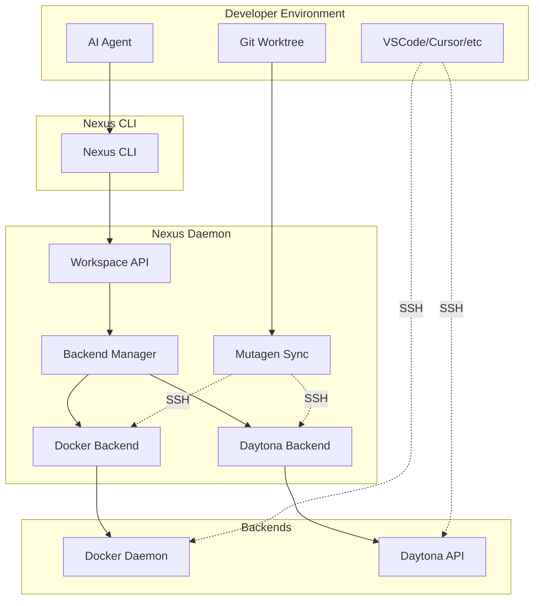

# Daytona Backend Integration PRD

**Status:** Draft  
**Created:** 2026-02-24  
**Last Updated:** 2026-02-24  
**Component:** Workspace Backend  
**Prerequisites:** Nexus CLI v0.1.0+, Workspace Daemon

---

## 1. Overview

### 1.1 Problem Statement

Currently, Nexus only supports Docker as a workspace backend. This limits deployment flexibility and scalability:

- **Local resource constraints**: Docker containers consume local CPU/memory
- **No ephemeral environments**: All workspaces are persistent, long-running
- **Limited horizontal scaling**: Cannot distribute workspaces across infrastructure
- **No cloud-native features**: Missing auto-scaling, geographic distribution, pay-per-use

Daytona provides ephemeral, API-driven sandboxes with sub-90ms startup, enabling a more scalable and cloud-native approach to workspace management while maintaining compatibility with Nexus's developer experience.

### 1.2 Core Design Principle

**"SSH endpoint is the universal interface, but direct API access available when needed for performance or features."**

```
┌─────────────────────────────────────────────────────────────────┐
│                     LOCAL MACHINE                               │
│  ┌──────────────────┐  ┌──────────────────┐                    │
│  │   Agent (Local)  │  │   Git Worktree   │                    │
│  │  OpenCode/Claude │  │  (Local Files)   │                    │
│  └────────┬─────────┘  └────────┬─────────┘                    │
│           │                     │                               │
│           └──────────┬──────────┘                               │
│                      │ Mutagen sync                             │
│                      ▼                                           │
│           ┌──────────────────┐                                   │
│  Common   │  SSH Connection  │                                   │
│  Abstraction              │                                   │
│           └────────┬─────────┘                                   │
└────────────────────┼────────────────────────────────────────────┘
                     │
        ┌────────────┴────────────┐
        ▼                         ▼
┌──────────────┐          ┌──────────────┐
│   Docker     │          │   Daytona    │
│  Container   │          │   Sandbox    │
│              │          │              │
│ SSH Server   │          │ SSH Gateway  │
│ :32800+      │          │ :2222        │
└──────────────┘          └──────────────┘
```

### 1.3 Goals

1. **Add Daytona as a backend option**: Seamless integration alongside Docker backend
2. **Unified UX**: Same CLI commands work regardless of backend via SSH abstraction
3. **Ephemeral by default**: Daytona workspaces auto-stop after inactivity (configurable)
4. **IDE integration**: VSCode Remote SSH support for Daytona sandboxes
5. **Agent compatibility**: Existing IDE plugins work without modification
6. **Escape hatches**: Access backend-specific features when needed (snapshots, LSP, previews)
7. **Performance optimization**: Use Daytona Process API and File API when faster than SSH

### 1.4 Non-Goals

- Remove Docker backend (it remains fully supported)
- Self-hosted Daytona server management (assumes hosted Daytona or user-managed)
- Multi-region workspace scheduling (Phase 2)
- Real-time bidirectional sync for Daytona (uses SSH + Mutagen for file sync)

---

## 2. Architecture

### 2.1 System Architecture



### 2.2 Backend Interface Design

The Backend interface separates **common abstraction** (SSH-based) from **backend-specific escape hatches**:

```go
type Backend interface {
    // ===== COMMON ABSTRACTION (SSH-based) =====
    // These work identically for all backends
    
    // Lifecycle operations - backend-specific implementation
    CreateWorkspace(ctx context.Context, req CreateRequest) (WorkspaceInfo, error)
    StartWorkspace(ctx context.Context, id string) error
    StopWorkspace(ctx context.Context, id string) error
    DeleteWorkspace(ctx context.Context, id string) error
    
    // Connection - returns SSH endpoint (universal interface)
    GetSSHConnection(ctx context.Context, id string) (SSHConnection, error)
    // SSHConnection {Host, Port, Username, PrivateKey}
    
    // Status operations
    GetWorkspaceStatus(ctx context.Context, id string) (WorkspaceStatus, error)
    GetResourceStats(ctx context.Context, id string) (*ResourceStats, error)
    
    // ===== BACKEND-SPECIFIC EXTENSIONS (Escape Hatches) =====
    // Allow direct access to provider features
    
    // Returns backend-specific capabilities
    GetCapabilities() BackendCapabilities
    
    // Execute backend-specific operations
    ExecuteProviderSpecific(ctx context.Context, id string, op ProviderOperation) (interface{}, error)
}

// SSH connection details (universal interface)
type SSHConnection struct {
    Host       string
    Port       int
    Username   string
    PrivateKey string  // PEM-encoded private key
}

// Capability flags
type BackendCapabilities struct {
    // Common
    SupportsSSH bool
    SupportsSync bool
    
    // Docker-specific
    SupportsDirectVolumeManagement bool
    SupportsImageCaching bool
    
    // Daytona-specific  
    SupportsSnapshots bool
    SupportsLSP bool
    SupportsWebPreviews bool
    SupportsProcessAPI bool
    SupportsFileAPI bool
}

// Provider operation for escape hatches
type ProviderOperation struct {
    Type    string                 // e.g., "daytona.snapshot.create", "docker.volume.create"
    Params  map[string]interface{} // Backend-specific parameters
}
```

### 2.3 Common Abstraction Layer

**The SSH endpoint is the universal interface.** All backends expose:

1. **SSH server** for command execution (`nexus workspace exec`)
2. **Mutagen sync** for file synchronization
3. **Git credential forwarding** via SSH agent

```go
// Common execution - works for ALL backends via SSH
func (b *BaseBackend) Exec(ctx context.Context, id string, cmd []string) (string, error) {
    conn, err := b.backend.GetSSHConnection(ctx, id)
    if err != nil {
        return "", err
    }
    
    return ssh.Execute(ctx, conn, cmd)
}

// Common file sync - works for ALL backends via Mutagen
func (b *BaseBackend) StartSync(ctx context.Context, id string, localPath string) error {
    conn, err := b.backend.GetSSHConnection(ctx, id)
    if err != nil {
        return err
    }
    
    return mutagen.CreateSession(ctx, localPath, conn)
}
```

### 2.4 Escape Hatch Mechanism

**When to use escape hatches:**
- Need backend-specific features (snapshots, previews)
- Performance matters (Daytona File API vs SSH/SCP)
- Managing backend resources (volumes, images)
- CI/CD optimization (Daytona Process API)

```go
// Example: Daytona escape hatch usage
func createSnapshot(ctx context.Context, backend Backend, workspaceID string) error {
    caps := backend.GetCapabilities()
    if !caps.SupportsSnapshots {
        return fmt.Errorf("backend does not support snapshots")
    }
    
    result, err := backend.ExecuteProviderSpecific(ctx, workspaceID, ProviderOperation{
        Type: "daytona.snapshot.create",
        Params: map[string]interface{}{
            "name": "baseline",
            "description": "Pre-feature baseline",
        },
    })
    // Handle result...
}

// Example: Docker escape hatch usage
func createVolume(ctx context.Context, backend Backend, name string, sizeGB int) error {
    caps := backend.GetCapabilities()
    if !caps.SupportsDirectVolumeManagement {
        return fmt.Errorf("backend does not support direct volume management")
    }
    
    result, err := backend.ExecuteProviderSpecific(ctx, "", ProviderOperation{
        Type: "docker.volume.create",
        Params: map[string]interface{}{
            "name": name,
            "size_gb": sizeGB,
        },
    })
    // Handle result...
}
```

### 2.5 Daytona Backend Implementation

```go
package daytona

import (
    "context"
    
    daytona "github.com/daytonaio/sdk/go"
    "github.com/nexus/nexus/packages/nexusd/internal/types"
)

type DaytonaBackend struct {
    client      *daytona.Client
    stateStore  StateStore
    apiKey      string
    apiURL      string
}

func NewDaytonaBackend(apiKey, apiURL string, store StateStore) (*DaytonaBackend, error) {
    client, err := daytona.New(daytona.Config{
        APIKey: apiKey,
        APIURL: apiURL,
    })
    if err != nil {
        return nil, err
    }
    
    return &DaytonaBackend{
        client:     client,
        stateStore: store,
        apiKey:     apiKey,
        apiURL:     apiURL,
    }, nil
}

// GetSSHConnection implements the common abstraction
func (b *DaytonaBackend) GetSSHConnection(ctx context.Context, id string) (SSHConnection, error) {
    sandbox, err := b.client.GetSandbox(ctx, id)
    if err != nil {
        return SSHConnection{}, err
    }
    
    return SSHConnection{
        Host:       sandbox.SSHHost,
        Port:       sandbox.SSHPort,
        Username:   "daytona",
        PrivateKey: sandbox.SSHPrivateKey,
    }, nil
}

// GetCapabilities returns Daytona-specific capabilities
func (b *DaytonaBackend) GetCapabilities() BackendCapabilities {
    return BackendCapabilities{
        SupportsSSH:        true,
        SupportsSync:       true,
        SupportsSnapshots:  true,
        SupportsLSP:        true,
        SupportsWebPreviews: true,
        SupportsProcessAPI: true,
        SupportsFileAPI:    true,
    }
}

// ExecuteProviderSpecific handles escape hatches
func (b *DaytonaBackend) ExecuteProviderSpecific(
    ctx context.Context, 
    id string, 
    op ProviderOperation,
) (interface{}, error) {
    switch op.Type {
    case "daytona.snapshot.create":
        return b.createSnapshot(ctx, id, op.Params)
    case "daytona.snapshot.restore":
        return b.restoreSnapshot(ctx, id, op.Params)
    case "daytona.preview.create":
        return b.createPreview(ctx, id, op.Params)
    case "daytona.lsp.start":
        return b.startLSP(ctx, id, op.Params)
    case "daytona.file.upload":
        return b.uploadFiles(ctx, id, op.Params)  // Fast File API
    case "daytona.file.download":
        return b.downloadFiles(ctx, id, op.Params)  // Fast File API
    case "daytona.process.execute":
        return b.executeProcess(ctx, id, op.Params)  // Fast Process API
    default:
        return nil, fmt.Errorf("unknown operation: %s", op.Type)
    }
}
```

---

## 3. User Flows

### 3.1 Flow 1: Standard Development (Common Abstraction)

```
1. Create workspace (SSH endpoint provisioned)
   nexus workspace create my-feature --backend=daytona
   
2. Mutagen syncs local worktree ↔ remote
   (Automatic sync started)
   
3. Agent edits local files (fast)
   VSCode/Cursor/OpenCode on local worktree
   
4. Changes sync automatically via Mutagen
   (Bidirectional sync)
   
5. Commands run via SSH exec
   nexus workspace exec my-feature -- npm test
```

### 3.2 Flow 2: AI Code Generation (Escape Hatch for Performance)

```
1. Agent generates code locally
   (Fast local generation)
   
2. Use Daytona File API (escape hatch) to upload quickly
   nexus workspace provider daytona file upload my-feature ./generated/ /workspace/
   (Faster than sync for bulk uploads)
   
3. Use Daytona Process API (escape hatch) to execute safely
   nexus workspace provider daytona process execute my-feature -- npm test
   (Faster than SSH for simple commands)
   
4. Results downloaded via File API
   nexus workspace provider daytona file download my-feature /workspace/results/ ./
   
5. Apply to local worktree
   (Standard git workflow)
```

### 3.3 Flow 3: Web Preview (Escape Hatch)

```
1. Developer runs web server in workspace
   nexus workspace exec my-feature -- npm run dev
   
2. Use Daytona preview command (escape hatch)
   nexus workspace provider daytona preview create my-feature --port=3000
   
3. Get shareable URL
   Preview URL: https://my-feature--3000.abc123.preview.daytona.io
   
4. Stakeholders review
   (Share URL with team)
   
5. Stop preview when done
   nexus workspace provider daytona preview delete my-feature --port=3000
```

### 3.4 Flow 4: Snapshot/Branch (Escape Hatch)

```
1. Workspace in good state
   (All tests passing)
   
2. Create Daytona snapshot (escape hatch)
   nexus workspace provider daytona snapshot create my-feature --name="baseline"
   
3. Create new workspace from snapshot
   nexus workspace create my-feature-v2 --from-snapshot=baseline --backend=daytona
   
4. Parallel work on branches
   (Both workspaces active)
   
5. Merge back
   (Standard git workflow)
```

### 3.5 Creating a Daytona Workspace

```bash
# Create with explicit backend (uses common abstraction)
nexus workspace create my-feature --backend daytona

# Create with specific resources
nexus workspace create ai-training --backend daytona --cpu 4 --memory 16 --disk 50

# Create from existing repo (Daytona clones it)
nexus workspace create api-service --backend daytona --from https://github.com/org/repo --branch feature/new-api
```

### 3.6 Opening a Workspace in IDE

**For Docker Backend (Current):**
```bash
nexus workspace open my-feature
# Opens VSCode locally on worktree path
```

**For Daytona Backend:**
```bash
nexus workspace open my-feature
# Fetches SSH endpoint from Daytona
# Opens VSCode with Remote-SSH to Daytona sandbox
# OR opens local worktree with Mutagen sync (configurable)
```

**IDE Integration Decision Matrix:**

| Backend | Default IDE Mode | File Location | Git Operations | Sync Method |
|---------|------------------|---------------|----------------|-------------|
| Docker | Local VSCode | Local worktree | Local git | Bind mount |
| Daytona | VSCode Remote SSH | Daytona sandbox | In-sandbox | Direct SSH |
| Daytona (alt) | Local VSCode | Local worktree | Local git | Mutagen sync |

### 3.7 When to Use Common Abstraction vs Escape Hatches

**Use Common Abstraction (SSH + Mutagen) when:**
- Agent needs to edit files
- Running standard commands
- Git operations
- General development workflow
- IDE Remote SSH connections

**Use Escape Hatches when:**
- Need backend-specific features (snapshots, previews, LSP)
- Performance matters (Daytona File API vs SSH/SCP)
- Managing backend resources (Docker volumes, images)
- CI/CD optimization (Daytona Process API for quick commands)
- Bulk file operations (upload/download thousands of files)

---

## 4. CLI Design

### 4.1 Common Commands (Work with Any Backend via SSH)

```bash
# Backend-aware workspace creation
nexus workspace create <name> [options]
  --backend <docker|daytona>    # Choose backend (default: config.default_backend)
  --region <region>             # Daytona region (daytona only)
  --auto-stop <minutes>         # Auto-stop interval (daytona only, 0=never)
  --ephemeral                   # Delete on stop (daytona only)

# Lifecycle commands (common abstraction)
nexus workspace start <name>
nexus workspace stop <name>
nexus workspace delete <name>

# Execution (common abstraction via SSH)
nexus workspace exec <name> -- <command>
nexus workspace shell <name>
nexus workspace ssh <name>  # Interactive SSH session

# Sync commands (common abstraction via Mutagen)
nexus sync start <name>     # Start Mutagen sync
nexus sync pause <name>     # Pause sync
nexus sync resume <name>    # Resume sync
nexus sync status <name>    # Show sync status

# Info command
nexus workspace info <name>
  # Shows backend type, SSH endpoint, resource usage, capabilities
```

### 4.2 Escape Hatch Commands (Backend-Specific)

```bash
# Backend-specific escape hatches
nexus workspace provider <backend> <operation> <workspace> [options]

# Daytona escape hatches
nexus workspace provider daytona snapshot create <name> --name=<snapshot-name>
nexus workspace provider daytona snapshot restore <name> --name=<snapshot-name>
nexus workspace provider daytona snapshot list <name>
nexus workspace provider daytona snapshot delete <name> --name=<snapshot-name>

nexus workspace provider daytona preview create <name> --port=<port> [--public]
nexus workspace provider daytona preview list <name>
nexus workspace provider daytona preview delete <name> --port=<port>

nexus workspace provider daytona lsp start <name> --language=<lang>
nexus workspace provider daytona lsp stop <name> --language=<lang>

# Fast File API (performance escape hatch)
nexus workspace provider daytona file upload <name> <local-path> <remote-path>
nexus workspace provider daytona file download <name> <remote-path> <local-path>

# Fast Process API (performance escape hatch)
nexus workspace provider daytona process execute <name> -- <command>

# Docker escape hatches
nexus workspace provider docker volume create <name> --volume=<vol-name> [--size=<GB>]
nexus workspace provider docker volume attach <name> --volume=<vol-name> --mount=<path>
nexus workspace provider docker volume detach <name> --volume=<vol-name>
nexus workspace provider docker volume delete <name> --volume=<vol-name>

nexus workspace provider docker image cache <name> --from=<image> [--to=<image>]
nexus workspace provider docker image prune

nexus workspace provider docker network create <network-name>
nexus workspace provider docker network connect <name> --network=<network-name>
nexus workspace provider docker network disconnect <name> --network=<network-name>
```

### 4.3 Backend Selection Logic

```go
func (m *BackendManager) GetBackend(backendType types.BackendType) (interfaces.Backend, error) {
    switch backendType {
    case types.BackendDocker:
        return m.dockerBackend, nil
    case types.BackendDaytona:
        if m.daytonaBackend == nil {
            return nil, fmt.Errorf("daytona backend not configured")
        }
        return m.daytonaBackend, nil
    default:
        return nil, fmt.Errorf("unknown backend: %s", backendType)
    }
}

func (m *BackendManager) ResolveBackend(preferred string) (interfaces.Backend, error) {
    if preferred != "" {
        return m.GetBackend(types.BackendTypeFromString(preferred))
    }
    // Use default from config
    return m.GetBackend(m.config.DefaultBackend)
}

// ExecuteProviderSpecific routes to appropriate backend
func (m *BackendManager) ExecuteProviderSpecific(
    ctx context.Context,
    backendType types.BackendType,
    workspaceID string,
    op types.ProviderOperation,
) (interface{}, error) {
    backend, err := m.GetBackend(backendType)
    if err != nil {
        return nil, err
    }
    
    // Verify capability exists
    caps := backend.GetCapabilities()
    if !isCapabilitySupported(caps, op.Type) {
        return nil, fmt.Errorf("operation %s not supported by backend %s", op.Type, backendType)
    }
    
    return backend.ExecuteProviderSpecific(ctx, workspaceID, op)
}
```

---

## 5. Configuration Schema

### 5.1 Global Configuration

```yaml
# ~/.nexus/config.yaml
version: "2"

workspace:
  default_backend: docker  # or "daytona"
  auto_start: true
  storage_path: ~/.nexus/workspaces

sync:
  # Mutagen configuration for all backends
  default_beta: remote  # 'remote' = workspace via SSH, 'local' = bind mount (docker only)
  ignore_patterns:
    - ".git"
    - "node_modules"
    - "*.log"

backends:
  docker:
    enabled: true
    # Docker-specific settings
    
  daytona:
    enabled: true
    api_key: "${DAYTONA_API_KEY}"  # From environment
    api_url: "https://app.daytona.io/api"  # or self-hosted
    default_region: "us-east-1"
    auto_stop_interval: 30  # minutes (0 = never)
    
    # Resource defaults
    default_resources:
      cpu: 2
      memory: 4  # GB
      disk: 20   # GB
      
    # Sync preferences
    sync:
      # When to use File API vs Mutagen
      use_file_api_threshold: 100  # files - use File API above this count
      use_process_api_threshold: 5  # seconds - use Process API if command shorter than this
```

### 5.2 Workspace-Specific Configuration

```yaml
# Stored in workspace metadata
name: my-feature
backend: daytona
backend_config:
  sandbox_id: "sb-abc123"
  region: "us-east-1"
  ssh_endpoint: "sb-abc123.ssh.daytona.io:2222"
  resources:
    cpu: 2
    memory: 4
    disk: 20
  auto_stop_interval: 60
  labels:
    project: "nexus"
    team: "platform"

# Sync configuration
sync:
  enabled: true
  alpha_path: /Users/dev/projects/my-feature  # Local worktree
  beta_path: /workspace  # Remote workspace path
  ignore:
    - ".git"
    - "node_modules"
```

### 5.3 Environment Variables

| Variable | Description | Default |
|----------|-------------|---------|
| `DAYTONA_API_KEY` | API key for Daytona | (required if enabled) |
| `DAYTONA_API_URL` | Daytona API endpoint | `https://app.daytona.io/api` |
| `NEXUS_DEFAULT_BACKEND` | Default backend type | `docker` |
| `NEXUS_DAYTONA_REGION` | Default region | (Daytona default) |
| `NEXUS_SYNC_THRESHOLD` | File count threshold for File API | 100 |

---

## 6. Implementation Details

### 6.1 Git Credential Flow

**SSH agent forwarding works for all backends:**

```
Local Machine:
  SSH Agent (with git credentials)
       │
       │ Forward agent
       ▼
  SSH Connection (common abstraction)
       │
       ├────────────┐
       ▼            ▼
  Docker Container  Daytona Sandbox
       │               │
       ▼               ▼
   Git operations   Git operations
   (local creds)    (local creds)
```

All backends use the same SSH agent forwarding mechanism for git authentication.

### 6.2 File Sync Implementation

**For Docker:**
- Default: Bind mount (no sync needed)
- Optional: Mutagen sync for remote Docker hosts

**For Daytona:**
- Default: Mutagen sync over SSH
- Escape hatch: File API for bulk operations

```go
func (s *SyncManager) SyncWorkspace(ctx context.Context, workspaceID string) error {
    workspace := s.store.Get(workspaceID)
    backend := s.backendManager.GetBackend(workspace.Backend)
    
    // Get SSH connection (common abstraction)
    conn, err := backend.GetSSHConnection(ctx, workspaceID)
    if err != nil {
        return err
    }
    
    // Create Mutagen session using SSH connection
    return mutagen.CreateSession(ctx, mutagen.SessionConfig{
        AlphaPath: workspace.LocalPath,
        BetaConn:  conn,  // SSHConnection for all backends
        BetaPath:  workspace.RemotePath,
    })
}
```

### 6.3 Capability Detection

```go
func (m *BackendManager) ListCapabilities(backendType types.BackendType) (types.BackendCapabilities, error) {
    backend, err := m.GetBackend(backendType)
    if err != nil {
        return types.BackendCapabilities{}, err
    }
    
    return backend.GetCapabilities(), nil
}

// CLI usage
func showBackendInfo(backend Backend) {
    caps := backend.GetCapabilities()
    
    fmt.Println("Capabilities:")
    fmt.Printf("  SSH Support: %v\n", caps.SupportsSSH)
    fmt.Printf("  Sync Support: %v\n", caps.SupportsSync)
    
    if caps.SupportsSnapshots {
        fmt.Println("  ✓ Snapshots (escape hatch)")
    }
    if caps.SupportsWebPreviews {
        fmt.Println("  ✓ Web Previews (escape hatch)")
    }
    if caps.SupportsLSP {
        fmt.Println("  ✓ LSP Integration (escape hatch)")
    }
    if caps.SupportsDirectVolumeManagement {
        fmt.Println("  ✓ Direct Volume Management (escape hatch)")
    }
}
```

### 6.4 Error Handling Strategy

```go
// Common abstraction errors
var (
    ErrWorkspaceNotFound = errors.New("workspace not found")
    ErrSSHConnectionFailed = errors.New("SSH connection failed")
    ErrSyncFailed = errors.New("file sync failed")
)

// Escape hatch errors
type ProviderSpecificError struct {
    Operation string
    Backend   string
    Cause     error
    Resolution string
}

func (e *ProviderSpecificError) Error() string {
    return fmt.Sprintf("%s operation failed for backend %s: %v\nResolution: %s",
        e.Operation, e.Backend, e.Cause, e.Resolution)
}

// Example error handling
func handleEscapeHatchError(err error) {
    if pse, ok := err.(*ProviderSpecificError); ok {
        if pse.Backend == "daytona" {
            switch {
            case strings.Contains(pse.Cause.Error(), "rate limit"):
                fmt.Println("Daytona API rate limit exceeded. Try again in 60 seconds.")
            case strings.Contains(pse.Cause.Error(), "quota"):
                fmt.Println("Resource quota exceeded. Consider upgrading or cleaning up old workspaces.")
            }
        }
    }
}
```

---

## 7. Migration Strategy

### 7.1 For Existing Users

**Phase 1: Opt-In (Immediate)**
```bash
# Existing workspaces remain Docker
nexus workspace list
NAME          BACKEND   STATUS
project-a     docker    running
project-b     docker    running

# Create new Daytona workspaces explicitly
nexus workspace create experiment --backend daytona
```

**Phase 2: Default Backend (Future)**
```bash
# User changes default backend
nexus config set workspace.default_backend daytona

# New workspaces use Daytona by default
nexus workspace create new-project  # Uses Daytona
```

### 7.2 Workspace Migration Tool

```bash
# Export Docker workspace and import to Daytona
nexus workspace export project-a --format daytona | \
  nexus workspace import project-a-daytona --backend daytona

# Or use the migrate command
nexus workspace migrate project-a --to-backend daytona
# Creates new Daytona workspace, preserves git history
```

### 7.3 Backward Compatibility

- Existing Docker workspaces continue to work unchanged
- Mixed backend environments supported
- CLI commands are backend-agnostic (common abstraction)
- Configuration versioned (v1 → v2)
- Escape hatches are additive only

---

## 8. Risk Analysis

### 8.1 Technical Risks

| Risk | Likelihood | Impact | Mitigation |
|------|------------|--------|------------|
| Daytona API changes break integration | Medium | High | Use SDK version pinning, abstraction layer, escape hatch versioning |
| SSH connection reliability | Medium | High | Implement connection retry, fallback to exec API via escape hatch |
| Mutagen sync performance issues | Medium | Medium | Use File API escape hatch for large transfers |
| IDE plugin incompatibility | Low | High | Test with major plugins, common abstraction ensures compatibility |
| Rate limiting on Daytona API | Medium | Medium | Implement caching, request batching for escape hatches |

### 8.2 User Experience Risks

| Risk | Likelihood | Impact | Mitigation |
|------|------------|--------|------------|
| Confusion about escape hatches | Medium | Medium | Clear documentation, `nexus workspace info` shows capabilities |
| Auto-stop surprises | Medium | High | Warnings before stop, configurable intervals |
| Cost overruns (Daytona billing) | Medium | High | Usage tracking, budget alerts |
| Performance expectations | Medium | Low | Document when to use escape hatches vs common abstraction |

### 8.3 Mitigation Strategies

1. **Feature Flags:** Daytona backend behind `--experimental` flag initially
2. **Fallback Mode:** Auto-fallback to common abstraction if escape hatch fails
3. **Clear Errors:** Backend-specific error messages with resolution steps
4. **Documentation:** Side-by-side comparison of when to use each approach

---

## 9. Implementation Plan

### Phase 1: Foundation (Week 1-2)

**Task 1: Extend Backend Interface**
- Files: `internal/interfaces/backend.go`, `internal/types/types.go`
- Add `SSHConnection` struct
- Add `GetSSHConnection()` method to Backend interface
- Add `GetCapabilities()` method
- Add `ExecuteProviderSpecific()` method
- Add `BackendCapabilities` struct
- Add `ProviderOperation` struct
- Add `BackendDaytona` to `BackendType` enum
- Add `DaytonaMetadata` to `Workspace` struct

**Task 2: Configuration Update**
- Files: `internal/config/config.go`, `internal/config/config_test.go`
- Add `DaytonaConfig` struct with sync preferences
- Add `SyncConfig` section
- Update config version to "2"
- Migration from v1 to v2

**Task 3: Daytona Backend Skeleton**
- Files: `internal/backends/daytona/backend.go`, `internal/backends/daytona/client.go`
- Implement Backend interface
- Add Daytona SDK dependency
- Implement `GetSSHConnection()` returning SSH endpoint
- Implement `GetCapabilities()` returning Daytona-specific flags

### Phase 2: Common Abstraction Layer (Week 3)

**Task 4: SSH Execution Layer**
- Files: `internal/exec/ssh.go`
- Create generic SSH execution client
- Support key-based auth
- Support agent forwarding
- Works with any Backend via `GetSSHConnection()`

**Task 5: Mutagen Sync Integration**
- Files: `internal/sync/mutagen.go`
- Refactor to use `SSHConnection` instead of Docker-specific code
- Create sync sessions using SSH endpoint
- Support for all backends

**Task 6: Common Command Implementation**
- Files: `internal/exec/common.go`
- Refactor `Exec`, `Shell`, `SSH` commands to use common abstraction
- Remove backend-specific exec implementations
- Single implementation via SSH

### Phase 3: Daytona Core Implementation (Week 4)

**Task 7: Workspace Lifecycle**
- Implement `CreateWorkspace`, `StartWorkspace`, `StopWorkspace`, `DeleteWorkspace`
- Map Daytona states to Nexus states
- Handle Daytona sandbox metadata
- Extract SSH credentials from Daytona

**Task 8: Daytona Escape Hatches**
- Files: `internal/backends/daytona/escape_hatches.go`
- Implement `ExecuteProviderSpecific()` handler
- Snapshot operations (create, restore, list, delete)
- Preview operations (create, list, delete)
- LSP operations (start, stop)
- File API operations (upload, download)
- Process API operations (execute)

### Phase 4: CLI Integration (Week 5)

**Task 9: Backend Selection**
- Files: `internal/cli/workspace.go`
- Add `--backend` flag to `create` command
- Backend auto-detection logic

**Task 10: Info Command Enhancement**
- Files: `internal/cli/workspace.go`
- Show backend type, SSH endpoint, resource usage
- Display capabilities (escape hatches available)

**Task 11: Provider Commands (Escape Hatches)**
- Files: `internal/cli/provider.go`
- Implement `nexus workspace provider` command tree
- Daytona subcommands (snapshot, preview, lsp, file, process)
- Docker subcommands (volume, image, network)
- Capability checking before execution

### Phase 5: IDE Integration (Week 6)

**Task 12: VSCode Remote SSH Support**
- Files: `internal/ide/vscode.go`
- Generate SSH config for Daytona workspaces using SSHConnection
- Open VSCode with Remote-SSH

**Task 13: IDE Plugin Updates**
- Files: `packages/opencode-plugin/`, `packages/claude/`, `packages/cursor/`
- Detect Daytona workspaces via common abstraction
- Set appropriate environment variables
- No plugin changes needed - uses SSH abstraction

### Phase 6: Testing & Polish (Week 7-8)

**Task 14: Integration Tests**
- Files: `test/integration/daytona_test.go`
- End-to-end Daytona workspace lifecycle
- SSH connection tests
- Escape hatch tests
- Performance comparison (SSH vs File API vs Process API)

**Task 15: Documentation**
- Files: `docs/tutorials/daytona-backend.md`, `docs/reference/daytona-config.md`, `docs/explanation/escape-hatches.md`
- User guides, troubleshooting
- When to use common abstraction vs escape hatches
- Migration guide

**Task 16: Dogfooding**
- Use Daytona backend for Nexus development
- Log friction points
- Performance benchmarks
- Validate escape hatch usage patterns

---

## 10. Appendix

### A. Command Quick Reference

```bash
# Common commands (work with any backend via SSH)
nexus workspace create <name> --backend <docker|daytona>
nexus workspace list --backend-filter daytona
nexus workspace info <name>  # Shows backend details + capabilities
nexus workspace exec <name> -- <command>  # Via SSH
nexus workspace ssh <name>  # Interactive SSH
nexus sync start <name>  # Mutagen sync
nexus sync status <name>

# Daytona-specific flags
nexus workspace create <name> --backend daytona \
  --region us-east-1 \
  --auto-stop 30 \
  --ephemeral

# Escape hatches - Daytona
nexus workspace provider daytona snapshot create <name> --name=<snapshot>
nexus workspace provider daytona preview create <name> --port=<port>
nexus workspace provider daytona lsp start <name> --language=python
nexus workspace provider daytona file upload <name> <local> <remote>
nexus workspace provider daytona process execute <name> -- <command>

# Escape hatches - Docker
nexus workspace provider docker volume create <name> --volume=<vol> --size=<GB>
nexus workspace provider docker image cache <name> --from=<image>

# Configuration
nexus config set workspace.default_backend daytona
nexus config set backends.daytona.api_key <key>
```

### B. Error Code Reference

| Code | Message | Resolution |
|------|---------|------------|
| `SSH_CONNECTION_FAILED` | SSH connection failed | Check workspace status and network |
| `SYNC_FAILED` | Mutagen sync failed | Check SSH connection, restart sync |
| `CAPABILITY_NOT_SUPPORTED` | Operation not supported by backend | Use `workspace info` to see capabilities |
| `DAYTONA_AUTH_FAILED` | Daytona authentication failed | Check DAYTONA_API_KEY |
| `DAYTONA_RATE_LIMITED` | Rate limit exceeded | Wait and retry |
| `DAYTONA_REGION_UNAVAILABLE` | Region not available | Try different region |
| `DAYTONA_SANDBOX_STOPPED` | Sandbox auto-stopped | Run `nexus workspace start` |
| `DAYTONA_QUOTA_EXCEEDED` | Resource quota exceeded | Upgrade plan or reduce usage |
| `DOCKER_VOLUME_IN_USE` | Volume in use by workspace | Stop workspace first |

### C. Environment Variable Reference

| Variable | Purpose | Example |
|----------|---------|---------|
| `DAYTONA_API_KEY` | Authentication | `dtn_abc123...` |
| `DAYTONA_API_URL` | API endpoint | `https://app.daytona.io/api` |
| `NEXUS_DEFAULT_BACKEND` | Default backend type | `daytona` |
| `NEXUS_WORKSPACE` | Active workspace | `my-feature` |
| `NEXUS_BACKEND` | Active backend | `daytona` |
| `NEXUS_DAYTONA_REGION` | Default region | `us-east-1` |
| `NEXUS_SYNC_THRESHOLD` | File count threshold for File API | `100` |

### D. Comparison: Common Abstraction vs Escape Hatches

| Feature | Common Abstraction | Escape Hatch |
|---------|-------------------|--------------|
| **Interface** | SSH endpoint + Mutagen | Direct API |
| **Usage** | Standard development | Backend-specific features |
| **Examples** | exec, shell, file edit | snapshots, previews, LSP |
| **Portability** | Works with ALL backends | Backend-specific only |
| **Performance** | Good (SSH overhead) | Optimal (direct API) |
| **When to use** | Daily workflow | Special features or performance |

### E. Backend Comparison

| Feature | Docker | Daytona |
|---------|--------|---------|
| **Startup Time** | 5-30s | <90ms (warm) |
| **Persistence** | Persistent | Ephemeral (configurable) |
| **Resource Usage** | Local CPU/RAM | Cloud (pay-per-use) |
| **File Access** | Local bind mount | SSH + Mutagen sync |
| **Offline Use** | Yes | No (requires internet) |
| **Git Operations** | Local | Via SSH agent forwarding |
| **Auto-Stop** | No | Yes (configurable) |
| **Scaling** | Single machine | Distributed |
| **Escape Hatches** | Volumes, Images, Networks | Snapshots, Previews, LSP, File API, Process API |
| **Use Case** | Daily dev, offline | CI/CD, ephemeral tasks, cloud development |

---

## 11. Open Questions

1. **Daytona Self-Hosting:** Should Nexus support managing self-hosted Daytona instances?
2. **Multi-Region:** Should Nexus abstract region selection or expose it directly?
3. **Snapshot Migration:** How to migrate snapshots between backends (if at all)?
4. **Cost Tracking:** Should Nexus integrate with Daytona billing API for usage alerts?
5. **Team Sharing:** How should Daytona workspace sharing integrate with Nexus?
6. **Escape Hatch Discovery:** Should we provide an interactive command to discover available escape hatches?

---

**Document End**

(End of file)
</content>